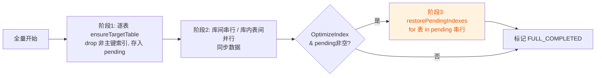
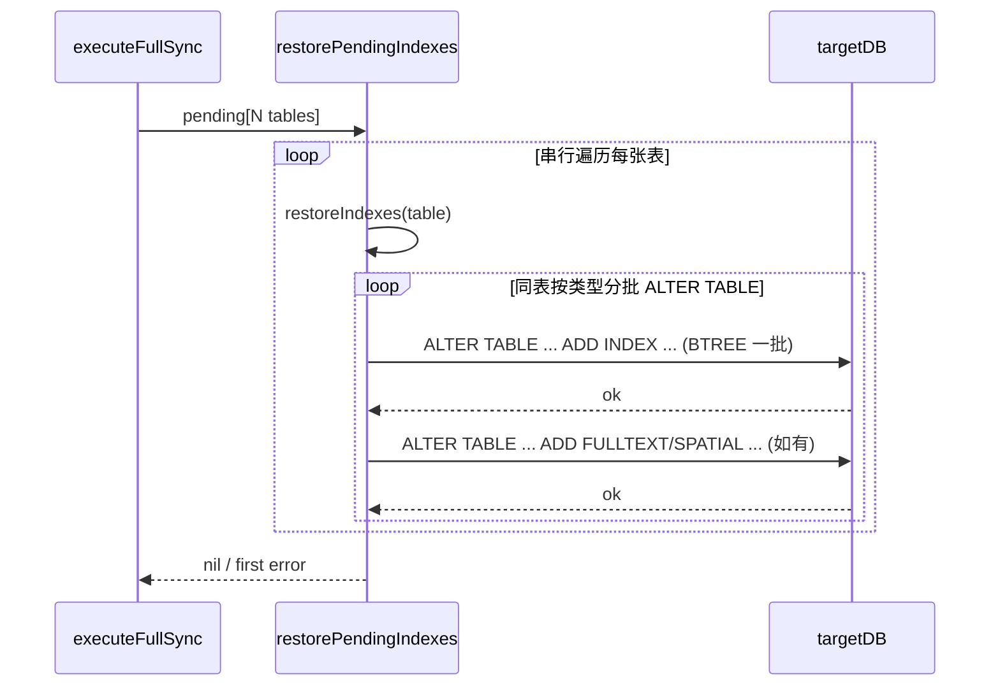
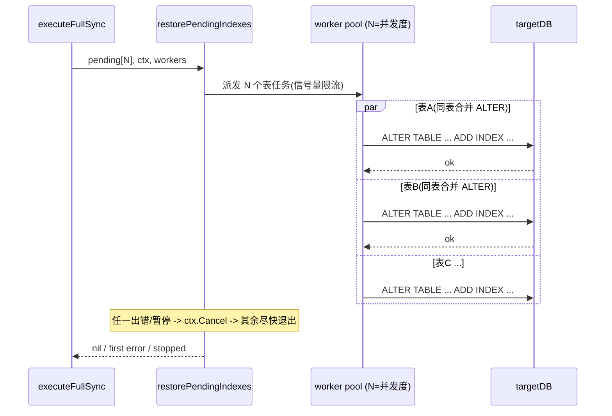

# 索引回放并发化优化方案

> 状态：**已完成 / 已实施**
> 影响路径：全量同步 · `optimize_index=true` 时的索引回放收尾阶段（阶段3）
> 关联代码：
> - 索引回放主流程：[`internal/task/application/service/task_service.go`](../../internal/task/application/service/task_service.go)
> - 任务配置实体：[`internal/task/domain/entity/task.go`](../../internal/task/domain/entity/task.go)
> - 全局调优配置：[`internal/config/config.go`](../../internal/config/config.go)
> - 单元测试：[`internal/task/application/service/task_service_test.go`](../../internal/task/application/service/task_service_test.go)
> - 配置示例：[`etc/application.toml.example`](../../etc/application.toml.example)
> - 配置文档：[`docs/CONFIGURATION.md`](../CONFIGURATION.md)

## 1. 背景与现象

`optimize_index=true` 时，全量同步会在阶段1删除目标表非主键索引以加速批量写入，等**所有库、所有表数据同步完成**后，在阶段3统一回放索引。该"延迟回放"机制由 commit `355ef2f`（优化创建索引顺序）引入，正确性没有问题，但**阶段3当前是单线程串行**：

- 决策位置：[`task_service.go:2246-2255`](../../internal/task/application/service/task_service.go#L2246-L2255)
- 串行实现：[`task_service.go:6576-6592`](../../internal/task/application/service/task_service.go#L6576-L6592) `restorePendingIndexes`
- 单表内索引合并回放：[`task_service.go`](../../internal/task/application/service/task_service.go) `restoreIndexes`（按 BTREE / FULLTEXT / SPATIAL 分批，每批一条 `ALTER TABLE`）

表现形式：

- 库含 N 张大表时，阶段3耗时 ≈ Σ(每张表索引重建时间)，成为全量同步的尾延迟主因；
- 日志可见 `阶段3: 所有表数据同步完成，开始按顺序恢复 N 张表的索引...` 后长时间停留；
- 用户暂停不被尊重——`restorePendingIndexes` 内部无停止信号检查，只有调用方在开始前/结束后各检查一次（[`L2247`](../../internal/task/application/service/task_service.go#L2247)、[`L2259`](../../internal/task/application/service/task_service.go#L2259)），大表索引重建期间暂停要等到整轮回放结束才生效。

## 2. 现状代码评审

### 2.1 当前串行流程





### 2.2 评审发现

| No. | 问题 | 影响 | 代码位置 |
|-----|------|------|----------|
| 1 | 表级串行回放，N 张表索引重建时间累加 | 尾延迟主因，本方案要解决 | [`task_service.go:6579-6589`](../../internal/task/application/service/task_service.go#L6579-L6589) |
| 2 | 恢复期间不响应暂停，`restorePendingIndexes` 内无 `isTaskStopped` 检查 | 大表回放期间暂停不被尊重 | [`task_service.go:6579-6592`](../../internal/task/application/service/task_service.go#L6579-L6592) |
| 3 | `restoreIndexes` 用 `targetDB.Exec`，无 context | 无法被取消，并发后无法中断在途 DDL | [`task_service.go:6652`](../../internal/task/application/service/task_service.go#L6652) |
| 4 | 测试硬断言顺序，sqlmock 默认按序匹配 | 并发后顺序不确定，测试会失败 | [`task_service_test.go:118-152`](../../internal/task/application/service/task_service_test.go#L118-L152) |
| 5 | 并发后每条 `ALTER TABLE` 占一条目标库连接，可能挤占连接池 | 并发度 > `target_max_open_conns` 时 goroutine 阻塞 | [`config.go:32`](../../internal/config/config.go#L32) |

## 3. 设计决策

| 决策点 | 选择 | 理由 |
|--------|------|------|
| 并发粒度 | **表级并发**，单表内索引按类型合并 `ALTER TABLE` | 不同表互不影响；同表 BTREE/FULLTEXT/SPATIAL 分批合并，每批一次扫描建齐，避免逐条 `CREATE INDEX` 重复扫表 |
| 并发度配置 | 新增 `index_restore_worker_count`，默认回退 `min(worker_count,4)`，硬上限 16 | 独立可调；索引回放 DDL（`ALTER TABLE ... ADD INDEX`）是 CPU/IO/临时空间密集型，默认保守取 4 |
| 错误策略 | fail-fast：首个错误通过 context 取消其余在途任务 | 与全量数据同步的 `WaitGroup + errChan` 模式一致 |
| 暂停响应 | 恢复期间持续检查 `isTaskStopped`，触发后返回 `errFullSyncStoppedByUser` | 与现有全量停止语义一致 |
| context 传播 | `restoreIndexes` 改用 `ExecContext` | 支持取消在途 DDL（DDL 本身不可中断，但可在下一条索引/下一张表前生效） |

### 目标流程



## 4. 实施步骤

### 步骤 1 — 任务配置新增字段

文件：[`internal/task/domain/entity/task.go`](../../internal/task/domain/entity/task.go)，`TaskConfig` 结构体（当前字段位于 [`L86-97`](../../internal/task/domain/entity/task.go#L86-L97)）。

在 `OptimizeIndex` 字段（[`L91`](../../internal/task/domain/entity/task.go#L91)）附近新增：

```go
OptimizeIndex            bool `json:"optimize_index"`               // 索引优化：先删除非主键索引，数据迁移完成后再重建
// IndexRestoreWorkerCount 阶段3索引回放的表级并发度；0 表示按 min(worker_count,4) 推导。
// 单表内多个索引按类型合并为 ALTER TABLE（BTREE 一批、FULLTEXT/SPATIAL 各一批）。建议 ≤ target_max_open_conns。
IndexRestoreWorkerCount  int  `json:"index_restore_worker_count"`   // 索引回放并发度；0=自动推导
```

### 步骤 2 — 新增并发度推导函数

文件：[`internal/task/domain/entity/task.go`](../../internal/task/domain/entity/task.go)，紧邻 [`EffectiveIntraTableWorkers`](../../internal/task/domain/entity/task.go#L424) 之后新增（仿其风格）：

```go
// EffectiveIndexRestoreWorkers 计算阶段3索引回放的实际表级并发度。
//   - configured: 任务配置 index_restore_worker_count
//   - workerCount: 任务配置 worker_count（回退基准）
//   - hardMax: 全局硬上限（来自 config.Sync.IndexRestoreHardMax，<=0 用内置 16）
//
// 推导规则：configured<=0 时取 min(workerCount,4)；再受 hardMax 封顶；最低 1。
// 单表内多个索引按类型合并 ALTER TABLE，仅表间并发。
func EffectiveIndexRestoreWorkers(configured, workerCount, hardMax int) int {
	const defaultCap = 4
	const builtinHardMax = 16

	n := configured
	if n <= 0 {
		n = workerCount
		if n <= 0 {
			n = defaultCap
		}
		if n > defaultCap {
			n = defaultCap
		}
	}
	max := hardMax
	if max <= 0 {
		max = builtinHardMax
	}
	if n > max {
		n = max
	}
	if n < 1 {
		n = 1
	}
	return n
}
```

### 步骤 3 — 全局配置新增硬上限

文件：[`internal/config/config.go`](../../internal/config/config.go)，`SyncTuneConfig` 结构体（[`L29-46`](../../internal/config/config.go#L29-L46)），在 `IntraTableHardMax`（[`L40`](../../internal/config/config.go#L40)）之后新增：

```go
// IntraTableHardMax 显式 intra 时的绝对上限；<=0 用内置 64
IntraTableHardMax int `toml:"intra_table_hard_max" json:"intra_table_hard_max"` // 单表内并行绝对上限
// IndexRestoreHardMax 阶段3索引回放表级并发的绝对上限；<=0 用内置 16
IndexRestoreHardMax int `toml:"index_restore_hard_max" json:"index_restore_hard_max"` // 索引回放并发绝对上限
```

### 步骤 4 — 重写 `restorePendingIndexes` 为并发

文件：[`internal/task/application/service/task_service.go`](../../internal/task/application/service/task_service.go)，替换 [`L6576-6592`](../../internal/task/application/service/task_service.go#L6576-L6592) 的串行实现。

新签名（增加 `ctx` 与 `workers` 参数）：

```go
// restorePendingIndexes 在所有表数据同步完成后，按表级并发恢复全量同步期间移除的索引。
// 单表内待建索引按类型（BTREE / FULLTEXT / SPATIAL）分批合并 ALTER TABLE；不同表之间按 workers 并发。
// 任一表失败或任务被停止时，通过 context 取消其余在途任务并尽快返回。
func (s *TaskService) restorePendingIndexes(ctx context.Context, runtime *taskRuntime, taskID string, pending []pendingIndexRestore, workers int) error {
	if len(pending) == 0 {
		return nil
	}
	if workers < 1 {
		workers = 1
	}
	if workers > len(pending) {
		workers = len(pending)
	}

	ctx, cancel := context.WithCancel(ctx)
	defer cancel()

	var (
		wg      sync.WaitGroup
		errOnce sync.Once
		firstErr error
	)
	sem := make(chan struct{}, workers)

	for _, item := range pending {
		if len(item.indexes) == 0 {
			continue
		}
		// 停止信号快速退出
		if s.isTaskStopped(taskID) {
			cancel()
			break
		}
		if ctx.Err() != nil {
			break
		}

		item := item
		sem <- struct{}{}
		wg.Add(1)
		go func() {
			defer wg.Done()
			defer func() { <-sem }()

			if ctx.Err() != nil {
				return
			}
			logger.Info("[Task %s] Restoring indexes for target table %s.%s...", taskID, item.targetSchema, item.targetTable)
			if err := s.restoreIndexes(ctx, runtime, item.targetSchema, item.targetTable, item.indexes); err != nil {
				errOnce.Do(func() {
					firstErr = fmt.Errorf("restore indexes for %s.%s: %w", item.targetSchema, item.targetTable, err)
					cancel() // 取消其余在途任务
				})
				return
			}
			logger.Info("[Task %s] Restored indexes for target table %s.%s", taskID, item.targetSchema, item.targetTable)
		}()
	}
	wg.Wait()

	// 停止信号优先于普通错误返回，与全量同步停止语义一致
	if s.isTaskStopped(taskID) {
		return errFullSyncStoppedByUser
	}
	return firstErr
}
```

> 说明：`sync` 包已在文件上方导入（项目内广泛使用 `sync.WaitGroup`），无需新增 import。

### 步骤 5 — `restoreIndexes` 支持 context 与同表 ALTER 合并

文件：[`internal/task/application/service/task_service.go`](../../internal/task/application/service/task_service.go)，`restoreIndexes`。

签名：

```go
func (s *TaskService) restoreIndexes(ctx context.Context, runtime *taskRuntime, schema, tableName string, indexes []map[string]interface{}) error
```

行为要点：

1. 循环开头加取消检查；
2. 逐个 `targetIndexExists`：已存在且定义一致则跳过，冲突则 fail-fast；
3. 待建索引按类型分组（BTREE / FULLTEXT / SPATIAL），同组合并为一条 `ALTER TABLE ... ADD INDEX ...`；
4. 每批使用 `ExecContext` + 连接类错误重试。

示例（同表 3 个 BTREE + 1 个 FULLTEXT → 两条 DDL）：

```sql
ALTER TABLE `db`.`t`
  ADD INDEX `idx_a` (`a`),
  ADD UNIQUE INDEX `uk_b` (`b`);

ALTER TABLE `db`.`t`
  ADD FULLTEXT INDEX `ft_c` (`c`);
```

### 步骤 6 — 更新调用方

文件：[`internal/task/application/service/task_service.go`](../../internal/task/application/service/task_service.go)，替换 [`L2246-2255`](../../internal/task/application/service/task_service.go#L2246-L2255)：

```go
if task.Config.OptimizeIndex && len(pendingIndexRestores) > 0 {
    if s.isTaskStopped(taskID) {
        logger.Info("[Task %s] Full sync detected stop signal before restoring indexes", taskID)
        return errFullSyncStoppedByUser
    }
    workers := taskEntity.EffectiveIndexRestoreWorkers(
        task.Config.IndexRestoreWorkerCount,
        task.Config.WorkerCount,
        s.config.Sync.IndexRestoreHardMax,
    )
    logger.Info("[Task %s] 阶段3: 数据同步完成，并发恢复 %d 张表索引 (workers=%d)...",
        taskID, len(pendingIndexRestores), workers)
    if err := s.restorePendingIndexes(ctx, runtime, taskID, pendingIndexRestores, workers); err != nil {
        return err
    }
    logger.Info("[Task %s] 阶段3完成：所有待恢复索引已并发处理", taskID)
}
```

> `ctx` 在 `executeFullSync` 作用域内已可用（见 [`L2140`](../../internal/task/application/service/task_service.go#L2140) 附近 `ctx` 的使用），无需额外传递。

### 步骤 7 — 更新单元测试

文件：[`internal/task/application/service/task_service_test.go`](../../internal/task/application/service/task_service_test.go)。

**7.1 改造现有顺序测试**（[`L118-152`](../../internal/task/application/service/task_service_test.go#L118-L152)）

重命名为 `TestRestorePendingIndexes_ProcessesTablesConcurrently`，关键改动：

- `mock.MatchExpectationsInOrder(false)` —— 允许乱序匹配
- 调用改为 `ts.restorePendingIndexes(ctx, runtime, "task-index-order", pending, workers)`
- 断言 `require.NoError(t, mock.ExpectationsWereMet())` 保留

```go
func TestRestorePendingIndexes_ProcessesTablesConcurrently(t *testing.T) {
	targetDB, mock, err := sqlmock.New()
	require.NoError(t, err)
	defer targetDB.Close()

	mock.MatchExpectationsInOrder(false)
	mock.ExpectExec("ALTER TABLE `target_db`.`users` ADD INDEX `idx_users_name` \\(`name`\\)").
		WillReturnResult(sqlmock.NewResult(0, 0))
	mock.ExpectExec("ALTER TABLE `target_db`.`orders` ADD UNIQUE INDEX `uk_orders_no` \\(`order_no`\\)").
		WillReturnResult(sqlmock.NewResult(0, 0))

	ts := &TaskService{}
	runtime := &taskRuntime{targetDB: targetDB}
	pending := []pendingIndexRestore{
		{targetSchema: "target_db", targetTable: "users", indexes: []map[string]interface{}{
			{"name": "idx_users_name", "non_unique": 1, "type": "BTREE", "columns": "`name`"},
		}},
		{targetSchema: "target_db", targetTable: "orders", indexes: []map[string]interface{}{
			{"name": "uk_orders_no", "non_unique": 0, "type": "BTREE", "columns": "`order_no`"},
		}},
	}

	require.NoError(t, ts.restorePendingIndexes(context.Background(), runtime, "task-index-order", pending, 2))
	require.NoError(t, mock.ExpectationsWereMet())
}
```

**7.2 新增停止信号测试**

```go
func TestRestorePendingIndexes_RespectsStopSignal(t *testing.T) {
	targetDB, mock, err := sqlmock.New()
	require.NoError(t, err)
	defer targetDB.Close()

	// 不期望任何 ALTER TABLE ... ADD INDEX 被执行
	ts := &TaskService{
		tasks: map[string]*taskEntity.SyncTask{
			"task-stop": {Context: taskEntity.SyncContext{Status: taskEntity.TaskStatusPaused}},
		},
	}
	runtime := &taskRuntime{targetDB: targetDB}
	pending := []pendingIndexRestore{
		{targetSchema: "db", targetTable: "t", indexes: []map[string]interface{}{
			{"name": "idx", "non_unique": 1, "type": "BTREE", "columns": "`c`"},
		}},
	}

	err = ts.restorePendingIndexes(context.Background(), runtime, "task-stop", pending, 2)
	require.ErrorIs(t, err, errFullSyncStoppedByUser)
	require.NoError(t, mock.ExpectationsWereMet())
}
```

**7.3 新增 fail-fast 测试**

```go
func TestRestorePendingIndexes_FailsFastOnFirstError(t *testing.T) {
	targetDB, mock, err := sqlmock.New()
	require.NoError(t, err)
	defer targetDB.Close()

	mock.MatchExpectationsInOrder(false)
	// 第一张表索引报错
	mock.ExpectExec("ALTER TABLE `db`.`a` ADD INDEX `idx_a` \\(`c`\\)").
		WillReturnError(fmt.Errorf("DDL failed"))
	// 第二张表可能因 ctx 取消而不执行；用 AnyTimes 容错
	mock.ExpectExec("ALTER TABLE `db`.`b` ADD INDEX `idx_b` \\(`c`\\)").
		WillReturnResult(sqlmock.NewResult(0, 0)).Maybe()

	ts := &TaskService{}
	runtime := &taskRuntime{targetDB: targetDB}
	pending := []pendingIndexRestore{
		{targetSchema: "db", targetTable: "a", indexes: []map[string]interface{}{
			{"name": "idx_a", "non_unique": 1, "type": "BTREE", "columns": "`c`"},
		}},
		{targetSchema: "db", targetTable: "b", indexes: []map[string]interface{}{
			{"name": "idx_b", "non_unique": 1, "type": "BTREE", "columns": "`c`"},
		}},
	}

	err = ts.restorePendingIndexes(context.Background(), runtime, "task-fail", pending, 2)
	require.Error(t, err)
	require.Contains(t, err.Error(), "restore indexes for db.a")
}
```

**7.4 新增并发度推导函数单测**

```go
func TestEffectiveIndexRestoreWorkers(t *testing.T) {
	cases := []struct{ configured, workerCount, hardMax, want int }{
		{0, 0, 0, 4},      // 全默认 -> 4
		{0, 8, 0, 4},      // 回退 min(8,4)=4
		{0, 2, 0, 2},      // workerCount<4 -> 2
		{6, 8, 0, 6},      // 显式 6
		{32, 8, 16, 16},   // 受 hardMax 封顶
		{0, 0, 2, 2},      // hardMax<defaultCap -> 2
		{-1, 0, 0, 4},     // 负数当 0
	}
	for _, c := range cases {
		require.Equal(t, c.want, taskEntity.EffectiveIndexRestoreWorkers(c.configured, c.workerCount, c.hardMax))
	}
}
```

### 步骤 8 — 同步配置示例与文档

**8.1 配置示例** [`etc/application.toml.example`](../../etc/application.toml.example)

在 `[sync]` 段补充：
```toml
# 索引回放并发绝对上限（<=0 用内置 16）
index_restore_hard_max = 16
```

**8.2 配置文档** [`docs/CONFIGURATION.md`](../CONFIGURATION.md)

在 `optimize_index` 说明附近补充：

```markdown
**index_restore_worker_count（索引回放并发度）**
- 含义：阶段3索引回放的表级并发度，不同表的索引重建并行执行
- 默认：0（自动推导为 min(worker_count, 4)）
- 建议值：4（保守）；目标库 CPU/IO/临时空间充足可调高
- 注意：
  - 单表内多个索引按类型合并为 `ALTER TABLE`（BTREE 一批、FULLTEXT/SPATIAL 各一批），避免逐条 `CREATE INDEX` 重复扫表
  - 并发度建议 ≤ `target_max_open_conns - 2`，每条 `ALTER TABLE` 会占用一条目标库连接
  - 并发回放期间目标实例 CPU、磁盘 IO、临时表空间负载会上升，需确保资源充足
```

**8.3 README API 字段表** [`README.md`](../../README.md)

在任务参数表的 `optimize_index` 行下方增加：
```
| index_restore_worker_count | int | 否 | 索引回放表级并发度，0=自动推导 min(worker_count,4)，默认0 |
```

**8.4 Web UI（可选）** [`web/src/App.vue`](../../web/src/App.vue)

若 `optimize_index` 已在创建任务表单暴露，可在其下增加 `index_restore_worker_count` 输入项（数字，placeholder "0=自动"）。

### 步骤 9 — 验证

```bash
# 定向测试
go test -run TestRestorePendingIndexes ./internal/task/...
go test -run TestEffectiveIndexRestoreWorkers ./internal/task/...

# 包级回归
go test ./internal/task/...
go vet ./...

# 全量回归（按 blast radius）
go test ./...
```

预期：
- 现有 `TestRestorePendingIndexes_ProcessesTablesSequentially` 被 7.1 的并发版本取代；
- 新增 3 个测试覆盖并发、停止、fail-fast；
- `go vet` 无告警。

## 5. 影响面与风险

| 项 | 说明 |
|----|------|
| 正确性 | 仅改阶段3回放路径，数据同步与历史 `full_sync_resume` 存档结构不受影响 |
| 同表并发 | 方案不对同表多个索引做 goroutine 并行；同表待建索引按类型合并 `ALTER TABLE`，每批一次扫描 |
| 连接池 | 每条 `ALTER TABLE` 占一条 `targetDB` 连接；并发度需 ≤ `target_max_open_conns - 2`，文档已注明 |
| 连接重试幂等 | 已补充失败后回查：若 `ALTER TABLE` 返回错误但目标索引均已存在且定义一致，则按成功处理，避免“服务端已成功、客户端断链”导致误失败 |
| 暂停语义 | MySQL 单条 `ALTER TABLE` 不可中断，context 只能在下一批/下一张表前生效；暂停后可能仍有 1 个在建 DDL 完成，文档需说明 |
| 目标库负载 | 并发回放期间 CPU/IO/临时空间负载上升，`innodb_online_alter_log_max_size` 与临时表空间需充足；默认并发度 4 正是为此保守取值 |
| 向后兼容 | `index_restore_worker_count=0` 时行为退化为"自动推导"，旧任务无需修改配置；未开启 `optimize_index` 的任务完全不受影响 |
| 测试 | 现有顺序断言测试需改造为乱序匹配；新增并发/停止/fail-fast 覆盖 |

## 8. 后续优化：同表索引合并 ALTER TABLE

> 状态：**已完成 / 已实施**（在表级并发方案之上叠加）

### 8.1 动机

表级并发无法解决「单张大表、索引很多」的场景：原先单表内对每个索引逐条 `CREATE INDEX`，InnoDB 建二级索引通常需扫表，10 个索引 ≈ 扫表 10 次。

### 8.2 实现

`restoreIndexes` 将同表待建索引按类型分组后，每组合并为一条 DDL：

| 批次 | 包含索引类型 | 示例 |
|------|-------------|------|
| BTREE | 普通索引、唯一索引（`non_unique=0`） | `ADD INDEX` / `ADD UNIQUE INDEX` |
| FULLTEXT | 全文索引 | `ADD FULLTEXT INDEX` |
| SPATIAL | 空间索引 | `ADD SPATIAL INDEX` |

FULLTEXT/SPATIAL 与 BTREE 分开执行，兼容部分 MySQL 版本拒绝同句混加的情况；纯 BTREE 表仍只有一条 `ALTER TABLE`。

关键函数：`buildAddIndexClause`、`buildAlterAddIndexesSQL`、`groupIndexRestoreBatches`、`execAlterAddIndexes`。

### 8.3 行为不变项

- 跨表并发、`fail-fast`、停止信号、连接重试语义与表级并发方案一致；
- `dropNonPrimaryKeyIndexes` 仍为逐条 `DROP INDEX`（成本远低于建索引）。

### 8.4 连接重试幂等补偿（已修复）

在索引批次执行中，已补充“失败后状态回查”：

- 当 `execAlterAddIndexes` 的 `ALTER TABLE ... ADD INDEX ...` 返回错误时，会逐个回查该批次目标索引；
- 若索引均已存在且定义一致（唯一性、索引类型、列顺序/前缀长度一致），则视为本批次已成功并继续流程；
- 该补偿用于覆盖“服务端已成功提交 DDL，但客户端因断链/网络抖动收到错误”的场景，避免误报失败。

## 9. 回滚方案

改动集中在：
- `restorePendingIndexes` / `restoreIndexes` 签名与实现
- `TaskConfig.IndexRestoreWorkerCount` 字段
- `SyncTuneConfig.IndexRestoreHardMax` 字段
- 调用方一处
- 测试与文档

如需回滚，将 `restorePendingIndexes` 恢复为串行 `for` 循环、`restoreIndexes` 改回 `Exec` 即可；新增配置字段保留不影响旧逻辑（值为 0 即自动推导）。

## 10. 验收清单

- [x] `TaskConfig.IndexRestoreWorkerCount` 字段已添加
- [x] `EffectiveIndexRestoreWorkers` 推导函数及单测已添加
- [x] `SyncTuneConfig.IndexRestoreHardMax` 已添加
- [x] `restorePendingIndexes` 改为表级并发 + context + 停止检查
- [x] `restoreIndexes` 改为 `ExecContext` + 同表按类型合并 `ALTER TABLE`
- [x] 调用方传入 `ctx` 与 `workers`
- [x] 现有顺序测试改造为乱序匹配
- [x] 新增停止信号 / fail-fast / 推导函数测试
- [x] `etc/application.toml.example`、`docs/CONFIGURATION.md`、`README.md` 已同步
- [x] `go test ./internal/task/...` 与 `go vet ./...` 通过
