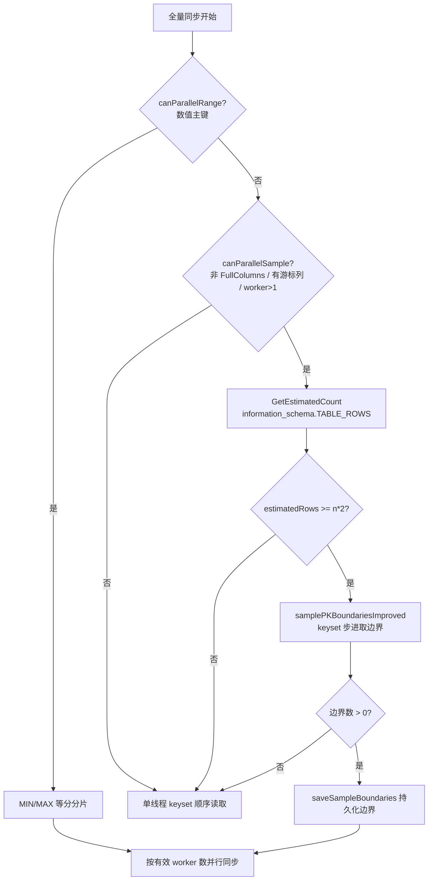
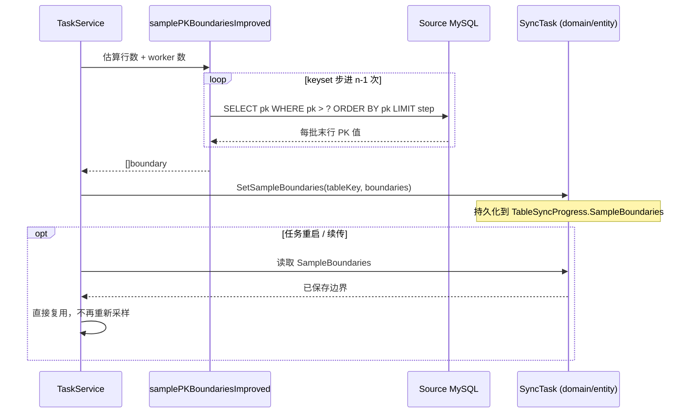

# 采样边界预扫描性能优化方案

> 状态：**已落地实现**
> 影响路径：全量同步 · 非数值主键/复合主键表的 `sample` 并行读取路径
> 关联代码：
> - 主流程：[`internal/task/application/service/task_service.go`](../../internal/task/application/service/task_service.go)
> - 读取器：[`internal/sync/infrastructure/reader/cursor_reader.go`](../../internal/sync/infrastructure/reader/cursor_reader.go)
> - 实体/续传：[`internal/task/domain/entity/task.go`](../../internal/task/domain/entity/task.go)
> - 单测：[`internal/task/application/service/task_service_test.go`](../../internal/task/application/service/task_service_test.go)

## 1. 背景与现象

某业务表约 **88M 行**，主键为 `varchar` 类型。全量同步开启 16 线程时，任务在"开始同步数据"之前长时间卡住，时间几乎全部耗费在"为每个 worker 计算分片边界"这一预扫描阶段。表现形式：

- 任务日志停在 `Dynamic boundary sampling: ...` 之前，迟迟不进入数据同步；
- 源库在该阶段出现持续索引扫描 I/O；
- 增大 `worker_count` 反而让预扫描更慢（线程越多，预扫描次数越多）。

## 2. 根因分析

### 2.1 触发条件

varchar 主键不满足 `isNumericPKColumn`，无法走 `range`（数值主键按 min/max 等分）路径，回落到 `sample` 路径：

- 决策位置：[task_service.go:2630 `canParallelSample`](../../internal/task/application/service/task_service.go#L2630)
- 边界计算：[task_service.go:4493 `samplePKBoundariesImproved`](../../internal/task/application/service/task_service.go#L4493)

### 2.2 优化前实现

预扫描分两步：

**第一步：精确计数**

```sql
SELECT COUNT(*) FROM `schema`.`table`
```

InnoDB 的 `COUNT(*)` 需要遍历二级索引/聚簇索引，88M 行相当于一次全索引扫描。

**第二步：串行 N-1 次深分页取边界**

```go
for i := 1; i < n; i++ {
    offset := totalRows * int64(i) / int64(n)   // 5.5M, 11M, ..., 82.5M
    // SELECT pk FROM `schema`.`table` ORDER BY pk LIMIT 1 OFFSET ?
    readSource.QueryRowContext(ctx, ..., offset).Scan(&pk)
}
```

15 次查询**串行**执行，每次 `ORDER BY pk LIMIT 1 OFFSET ?`。

### 2.3 为什么慢到不可接受

MySQL 的 `OFFSET` 无法"跳转"到指定位置，必须沿索引逐行读取并丢弃 `offset` 行后才能返回第 `offset+1` 行。因此：

- 第 1 次查询遍历 5.5M 索引项；
- 第 2 次遍历 11M；
- …
- 第 15 次遍历 82.5M。

累计索引项遍历量：

```
Σ(i=1..15) (i × 88M/16) = (88M/16) × (1+2+...+15) = 88M × 7.5 ≈ 660M 次
```

加上 `COUNT(*)` 的 88M，预扫描阶段约等于 **7.5 倍全表索引扫描**，且全部串行。这正是"开了 16 线程要扫 15 次才能开始同步"的根因。

> 注：`worker_count` 越大，`n-1` 越大，累计遍历量按 O(n²) 增长，所以"加线程反而更慢"。

### 2.4 优化后实现

当前代码已用 **keyset 步进 + information_schema 估算行数** 替代上述逻辑：

- 行数估算：[task_service.go:2661](../../internal/task/application/service/task_service.go#L2661) 调用 `GetEstimatedCount`（基于 `information_schema.TABLES.TABLE_ROWS`），避免 `COUNT(*)` 全扫。
- 边界计算：[task_service.go:4493 `samplePKBoundariesImproved`](../../internal/task/application/service/task_service.go#L4493) 使用 keyset 步进：

```sql
SELECT pk FROM `schema`.`table` WHERE pk > ? ORDER BY pk LIMIT ?
```

沿主键索引单遍推进，每批只取 `step` 行的最后一行作为边界。预扫描索引扫描量从约 **7.5×** 降到 **1×**，并且去掉了 `COUNT(*)`。

## 3. 优化方案

核心目标：把 **7.5× 全表扫描 + 1× COUNT(*)** 降为 **1× 单遍扫描、零 COUNT(*)**。

### 3.1 主方案 C：Keyset 步进取边界（推荐）

**思路**：用 keyset 分页（`WHERE pk > ? ORDER BY pk LIMIT step`）沿主键索引顺序推进，每批的最后一行作为下一个分片边界，重复 `n-2` 次即可得到 `n-1` 个边界。整个预扫描只遍历主键索引**一遍**，且分批执行、内存有界、可取消。

**算法**：

```text
1. lastID = nil
2. boundaries = []
3. step = max(1, estimatedRows / n)          // 用估算行数，见 3.2
4. while len(boundaries) < n-1:
       batch = ReadBatchByKeys(ctx, lastID, step)   // WHERE pk > lastID ORDER BY pk LIMIT step
       if len(batch) < step:
           break                                  // 已到表尾，实际行数少于估算，有效 worker 自动减少
       lastID = batch 最后一行的主键值
       boundaries.append(normalizePKBoundaryValue(lastID))
5. return boundaries
```

**为什么选 C**：

| 维度 | 说明 |
|---|---|
| 扫描量 | 恰好 1× 主键索引（只取 pk 列，不取全行） |
| 内存 | 每批仅 `step` 行的 pk 值，有界 |
| 可取消/续传 | 每批是短查询，响应 ctx 取消；sample 路径本就是表级续传，边界首跑后持久化复用，语义不变 |
| 复用现有代码 | 逻辑对齐 `RangeShardingReader.ReadBatchByKeys`（已支持单列与复合主键，见 [cursor_reader.go:253](../../internal/sync/infrastructure/reader/cursor_reader.go#L253)） |
| 正确性 | 分片只需"连续、不重叠"，边界无需绝对均匀，因此用估算行数算 step 完全安全 |

**边界情况处理**：

- **估算偏小**（实际行数 > 估算）：循环提前结束，`len(boundaries) < n-1`，有效 worker 自动减少。现有代码（[task_service.go:2688](../../internal/task/application/service/task_service.go#L2688)）已支持按可用边界数降低 `intraWorkers`，无需新增逻辑。
- **估算偏大**（实际行数 < 估算）：循环会多跑几批直到表尾，最多多扫一个 `step`，影响可忽略。
- **复合主键**：`buildKeysetStepQuery` 内部把 `(pk1,...,pkN) > (v1,...,vN)` 展开为 OR 走联合索引，`lastID` 以 `[]interface{}` 传递，与现有 `compareBoundaryValues` 一致。
- **边界单调性**：keyset 沿主键升序推进，边界天然递增，代码保留非递增边界的跳过保护作为兜底（[task_service.go:4575](../../internal/task/application/service/task_service.go#L4575)）。

### 3.2 辅助优化 D：估算行数替代 COUNT(*)

**思路**：用 `information_schema.TABLES.TABLE_ROWS` 毫秒级拿到估算行数计算 `step`，彻底消除 88M 行的 `COUNT(*)` 全扫。读取器已实现该方法：[cursor_reader.go `GetEstimatedCount`](../../internal/sync/infrastructure/reader/cursor_reader.go#L200)。

```sql
SELECT TABLE_ROWS FROM information_schema.TABLES
WHERE TABLE_SCHEMA = ? AND TABLE_NAME = ?
```

**安全性论证**：

- InnoDB 的 `TABLE_ROWS` 是统计估算值（误差常见 10%~40%），但**只用于计算 step**，不参与分片正确性。
- 分片正确性仅依赖"边界值升序、区间连续不重叠"，与 step 是否精确无关。
- 估算偏小→有效 worker 略减（仍正确）；估算偏大→最后一个 worker 分到稍大尾部（仍正确）。
- 因此可用估算行数无副作用地消除 `COUNT(*)`。

### 3.3 备选方案 A：单次流式扫描取边界

`SELECT pk FROM table ORDER BY pk` 单条流式游标扫一遍，Go 侧按 step 间隔取边界值。扫描量同为 1×，但单条长游标对连接超时/取消/续传不够友好，且与现有 keyset 分页风格不一致，作为 C 的备选说明，不主推。

### 3.4 降级方案 B：并发执行现有 OFFSET 查询（仅兜底）

将 15 次 `OFFSET` 查询用有限并发池并发执行。墙钟时间下降到接近最深的单次 OFFSET 耗时，但**总索引扫描量仍是 7.5×**，且 16 路并发深分页会冲击源库。仅当 C/A 因故不可用时作为兜底，不建议作为主方案。

## 4. 方案对比与选型

| 方案 | 索引扫描量 | COUNT(*) | 内存 | 可取消/续传 | 源库压力 | 选型 |
|---|---|---|---|---|---|---|
| 旧实现（串行深 OFFSET） | ~7.5× | 需要 | 极低 | 差（串行长） | 中（串行） | 已废弃 |
| B 并发 OFFSET | ~7.5× | 需要 | 极低 | 中 | 高（并发深扫） | 仅兜底 |
| A 单次流式 | 1× | 不需要 | 中（游标） | 差（长游标） | 低 | 备选 |
| **C Keyset 步进** | **1×** | **不需要** | 有界 | **好（分批短查询）** | 低 | **已落地** |
| + D 估算行数 | — | **消除** | — | — | — | **已叠加** |

最终选型：**C + D**（已落地）。

## 5. 整体流转关系

### 5.1 预扫描阶段流程



### 5.2 keyset 步进算法流程

```mermaid
flowchart TD
    A[step = estimatedRows / n] --> B[boundaries = []<br/>lastID = nil]
    B --> C{len(boundaries) < n-1?}
    C -->|否| D[返回 boundaries]
    C -->|是| E{ctx 已取消?}
    E -->|是| F[返回 ctx.Err]
    E -->|否| G[执行 WHERE pk > lastID<br/>ORDER BY pk LIMIT step]
    G --> H{rowsRead < step?}
    H -->|是| D
    H -->|否| I{lastBoundary 单调递增?}
    I -->|否| J[跳过并推进 lastID]
    I -->|是| K[boundaries.append(lastBoundary)]
    J --> C
    K --> L[lastID = lastBoundary]
    L --> C
```

### 5.3 sample 路径续传边界流转



## 6. 已落地实现

### 6.1 关键函数与位置

| 函数 | 文件 | 作用 |
|---|---|---|
| `samplePKBoundariesImproved` | [task_service.go:4493](../../internal/task/application/service/task_service.go#L4493) | keyset 步进主算法 |
| `buildKeysetStepQuery` | [task_service.go:4595](../../internal/task/application/service/task_service.go#L4595) | 构造 keyset 步进 SQL |
| `buildKeysetCompositeWhere` | [task_service.go:4630](../../internal/task/application/service/task_service.go#L4630) | 复合主键元组比较展开为 OR |
| `readKeysetStepLastPK` | [task_service.go:4652](../../internal/task/application/service/task_service.go#L4652) | 流式读取每批末行 PK |
| `compareBoundaryValues` | [task_service.go:4880 附近](../../internal/task/application/service/task_service.go#L4880) | 边界值单调性比较 |
| `normalizePKBoundaryValue` | [task_service.go:4905](../../internal/task/application/service/task_service.go#L4905) | `[]byte` 归一化为 `string` |
| `saveSampleBoundaries` | [task_service.go:5220](../../internal/task/application/service/task_service.go#L5220) | 持久化首跑边界 |
| `SetSampleBoundaries` | [task.go:408](../../internal/task/domain/entity/task.go#L408) | 领域实体持久化入口 |
| `GetEstimatedCount` | [cursor_reader.go:200](../../internal/sync/infrastructure/reader/cursor_reader.go#L200) | `information_schema.TABLES` 估算行数 |

### 6.2 调用入口

```text
TaskService.syncTableData
  └── canParallelRange? 数值主键
        └── 否
              └── canParallelSample?
                    └── 是
                          ├── GetEstimatedCount
                          └── samplePKBoundariesImproved
                                ├── buildKeysetStepQuery
                                └── readKeysetStepLastPK
                          └── saveSampleBoundaries / SetSampleBoundaries
```

### 6.3 变更约束

1. **行数来源切换**：调用处 [task_service.go:2661](../../internal/task/application/service/task_service.go#L2661) 已改为 `GetEstimatedCount`；保留"行数过少不并行"的阈值判断（用估算值近似即可）。
2. **复用现有读取器**：`buildKeysetStepQuery` 与 `RangeShardingReader.ReadBatchByKeys` 采用相同的 keyset SQL 与复合主键展开风格，避免重复实现。
3. **续传语义保持不变**：sample 路径仍为表级续传（见 [task.go:152](../../internal/task/domain/entity/task.go#L152)），首跑边界通过 `SetSampleBoundaries` 持久化、续传复用。新算法产出的边界同样走 `saveSampleBoundaries`（[task_service.go:5220](../../internal/task/application/service/task_service.go#L5220)），契约不变。
4. **边界归一化**：继续用 `normalizePKBoundaryValue` 处理 `[]byte`/`string` 类型差异，保证跨进程续传比较一致。
5. **失败回退**：估算行数不可用或步进首批即失败时，回退到单线程 keyset 顺序读取（现有 `canParallelSample = false` 分支），不阻断同步。
6. **日志**：保留 `Dynamic boundary sampling` 摘要日志，增加 `estimatedRows`、`requestedWorkers`、`effectiveWorkers`、`step`、`pkCols`、`boundaries` 字段便于排查。

## 7. 验证与测试

已补充/调整的单元测试位于 [`internal/task/application/service/task_service_test.go`](../../internal/task/application/service/task_service_test.go)：

1. **`TestSamplePKBoundariesImproved_KeysetStepsForAllWorkers`**（[task_service_test.go:1743](../../internal/task/application/service/task_service_test.go#L1743)）
   - 验证 keyset 步进算法取代 `LIMIT 1 OFFSET ?`；
   - 断言发出 `n-1` 条 `WHERE pk > ? ... LIMIT ?` 查询；
   - 断言产出边界单调递增。

2. **`TestSamplePKBoundariesImproved_EstimatedRowsTooSmall`**（[task_service_test.go:1783](../../internal/task/application/service/task_service_test.go#L1783)）
   - 估算行数小于 `n*2` 时直接返回错误，调用方回退到单线程 keyset 读取。

3. **`TestSamplePKBoundariesImproved_EstimatedTooLargeConvergesAtTableEnd`**（[task_service_test.go:1799](../../internal/task/application/service/task_service_test.go#L1799)）
   - 估算行数偏大时，最后一批 `rowsRead < step` 即收敛，有效 worker 自动减少。

4. **回归验证**
   - `go test ./internal/task/... ./internal/sync/...`
   - 确认 `range` / `keyset` / `nopk` 路径不受影响。

## 8. 风险与回滚

| 风险 | 影响 | 缓解 |
|---|---|---|
| 估算行数误差大 | 分片不均，尾 worker 偏重 | 正确性不受影响；可记录实际行数用于后续校准；必要时对超大表保守降低 worker 数 |
| keyset 步进在超宽复合主键上 SQL 较重 | 单批耗时略增 | step 取较大值减少批数；`buildKeysetCompositeWhere` 已按联合索引展开 |
| 改动影响续传兼容 | 已存档的旧 sample 边界 | 续传复用已持久化的 `SampleBoundaries`，不重算；仅首跑走新算法 |
| 回滚 | — | 改动集中在 `samplePKBoundariesImproved` 与行数获取处，回滚即恢复旧 `LIMIT 1 OFFSET ?` + `COUNT(*)` |

## 9. 预期收益

- 预扫描索引扫描量：**7.5× → 1×**；
- 消除 88M 行 `COUNT(*)` 全扫；
- 预扫描墙钟时间预计下降一个数量级以上，大表可"秒级进入数据同步"；
- `worker_count` 增大不再线性放大预扫描成本（O(n²) → O(n) 单遍）。
