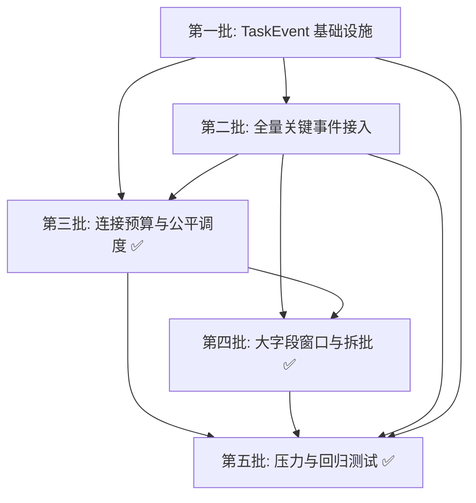
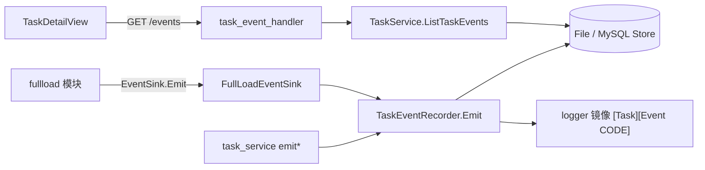

# 全量整改五批实施计划

## 文档说明

本文档由整改方案拆解而来，用于排期、拆 issue 与验收勾选。对应目标：

1. ~~大字段不再仅凭类型把 `LIMIT 1000` 降到 100。~~ ✅ B4
2. ~~表级并发与单表并发不再复用同一参数导致连接池独占。~~ ✅ B3
3. ~~大表不再占满共享队列使后续表长期等待。~~ ✅ B3 读公平 + B4 写公平
4. 任务详情可见降级、阻塞、重试等关键过程。 ✅ B1+B2（V1 存量 logger 部分未迁移）
5. 关键日志可见且不被普通 INFO 进度刷屏。 ✅ B1

**关联设计**：整改方案全文见会话记录；代码现状审阅结论见同主题讨论。

**状态图例**：任务项使用 `- [ ]` 勾选框，完成后改为 `- [x]`。

---

## 依赖总览



**关键路径**：

```text
B1-T01 → B1-T04 → B1-T05/T06 → B1-T03 → B1-T07 → B1-T08 → B1-T09 → B1-T11
  → B2-T02/T05/T06 → B3-T02 → B3-T05 → B4-T03 → B4-T04 → B4-T10 → B5-T02/T03/T07
```

---

## 实施进度与交接（给后续开发者）

> **最后更新**：2026-07-27（B5 integration + 写队列 bugfix）  
> **当前状态**：**B1～B5 已全部交付**（含 integration 压测）；`fault_injection_test.go` 仍可在目标环境单独跑。

### 总览

| 批次 | 状态 | 说明 |
|------|------|------|
| **B1 TaskEvent 基础设施** | ✅ 已完成 | 事件模型、双存储、Recorder、API、详情页 UI、生命周期/阶段事件 |
| **B2 全量关键事件接入** | ✅ 已完成 | fullload 各路径 `EventSink.Emit`、V1 关键路径、lint、前端筛选 |
| **B3 连接预算与公平调度** | ✅ 已完成 | 配置拆分、read_budget、chunk_scheduler、reader/engine 接入、指标、**T07 reportLoop** |
| **B4 大字段窗口与拆批** | ✅ 核心已完成 | 删除静态 LIMIT 降级、逻辑窗口=batch_size、宽表自动两阶段、字节拆批、公平写队列 |
| **B5 压力与回归测试** | ✅ 已完成 | T01～T07 单测/契约/E2E ✅；integration ✅（`integration_b5_test.go`）；写队列 pollKey/多表 writer 切换 bugfix |

### 第一批做了什么（可运行能力）

1. **独立事件管道**：任务关键过程写入 `TaskEventStore`（与任务 JSON 存档分离），并镜像到 logger。
2. **execution 轮次**：每次 `StartTask` 生成新 `execution_id`（UUID，存于 `taskRuntime` + Recorder 内存）；与 `FullLoadRunID`（V2 staging 恢复，持久化在 `ProcessContext`）分离。
3. **HTTP 查询**：`GET /api/tasks/:id/events`、`GET /api/tasks/:id/event-executions`；删除任务联动清理事件。
4. **Web UI**：任务详情「日志与错误」页签展示 KEY 事件摘要 + 表格；运行中 3s 增量轮询；角标 ⚠WARN ✕ERROR。
5. **首批业务事件**（经 `TaskService.emitLifecycle` / `emitPhase` / `emitTaskConfigEffective`）：
   - 生命周期：`TASK_SCHEDULED/STARTED/RESUMED/PAUSED/STOPPED/COMPLETED/FAILED`、`TASK_CONFIG_EFFECTIVE`
   - 阶段：`PHASE_DDL_PREP_STARTED`、`PHASE_P0_CAPTURED`、`PHASE_BASE_SCAN_*`、`PHASE_P1_CAPTURED`、`PHASE_CATCHUP_*`、`PHASE_INDEX_RESTORE_*`、`PHASE_INCREMENTAL_STARTED`
6. **V2 引擎接线**：`full_load_v2.go` 注入 `FullLoadEventSink`；**B2 已在 fullload 全路径调用 `EventSink.Emit`**（见下文「第二批做了什么」）。

### 第二批做了什么（可运行能力）

1. **V2 生效配置与池 cap**（`engine.go`）  
   - `FULL_LOAD_CONFIG_EFFECTIVE`：池 cap 完成后 emit 一次，含 read/write/table_parallel/buffer/staging 等 details。  
   - `SOURCE_POOL_BUDGET_CAPPED` / `TARGET_POOL_BUDGET_CAPPED`：因连接池上限下调并发时 emit。

2. **表规划与降级**（`chunk.go` + `reader.go`）  
   - `TABLE_PLAN_CREATED`：每张表 chunk 规划完成后。  
   - `TABLE_ESTIMATE_FAILED`：`TABLE_ROWS` 估算不可用。  
   - `TABLE_CHUNK_PLAN_FALLBACK`：稀疏整数 PK 改 keyset 采样切分。  
   - `TABLE_PARALLELISM_REDUCED`：有效并行读 < 期望并行读。  
   - `NOPK_SEQUENTIAL_FALLBACK`：无 PK/UK 表单 worker 流式读。  
   - `SLOW_SOURCE_QUERY`：超过 `SlowQueryWarnThreshold`（每查询一次）。  
   - B4 补充：`WIDE_TABLE_TWO_PHASE_ENABLED`、`ROW_EXCEEDS_BATCH_BYTES`。

3. **连接池与背压**（`pool_watch.go` + `engine.go` reportLoop）  
   - `SOURCE_POOL_WAIT_HIGH`：源池 in_use 高或 wait_count 增长（30s 节流）。  
   - `QUEUE_BACKPRESSURE_HIGH` / `QUEUE_BACKPRESSURE_RECOVERED`：队列 ≥80% / 恢复至 <50%（状态机，非 5s progress）。

4. **写路径与表级重试**（`writer.go` + `retry.go`）  
   - `WRITE_LOCK_RETRY`、`TX_COMMIT_UNKNOWN`、`TX_COMMIT_VERIFIED_*`、`TX_REPLAY_*`。  
   - `TABLE_READ_RETRY` / `TABLE_READ_RETRY_EXHAUSTED` / `TABLE_READ_BATCH_RETRY`。  
   - `STAGING_TABLE_CREATED` / `PUBLISHED` / `DROPPED`。

5. **Task 层补充**（`task_service.go` + `task_event_wiring.go`）  
   - `PHASE_DDL_PREP_COMPLETED`（V2 schema 锁获取后）。  
   - `SCHEMA_LOCK_LOST`、`CHECKPOINT_PERSIST_FAILED`、`INDEX_RESTORE_FAILED`。  
   - V1 路径 `NOPK_SEQUENTIAL_FALLBACK`（`syncDatabasePair` 内联全量）。  
   - 新增便捷方法：`emitTableEvent` / `emitRetryEvent`。

6. **静态检查**（`internal/task/linttasklog/lint_test.go`）  
   - fullload 包禁止 `logger.Warn/Error` 带 `[Task` 前缀（业务语义改走 EventSink；引擎日志改用 `[FullLoadV2] task=...`）。

7. **前端筛选**（`useTaskEvents.js` + `TaskDetailView.vue`）  
   - 分类：关键事件 / WARN+ / 仅 ERROR / 调度与并发 / 连接池与背压 / 重试与恢复 / 阶段切换。  
   - 表名筛选（`source_table` 参数 + 客户端过滤）。

**仍走 logger、不进 KEY 事件列表**：`engine.reportLoop` 每 5s 的 progress INFO（与 B1 约定一致）。

### 核心代码入口（接 B5 integration 前必读）

```text
Emit 统一入口
  internal/task/application/service/task_event_recorder.go   → TaskEventRecorder.Emit（60s 指纹聚合 → *_REPEATED）

TaskService 便捷封装
  internal/task/application/service/task_event_wiring.go     → emitLifecycle / emitPhase / emitTableEvent / emitRetryEvent
  internal/task/application/service/full_load_v2.go          → FullLoadEventSink 注入；RawOptions 含 table/per-table 字段

fullload 侧（B2 事件 + B3 读调度 + B4 拆批/写公平 + B3-T07 表进展）
  internal/sync/fullload/events.go                           → 事件码常量 + Emit() / optionsEventDetails
  internal/sync/fullload/options.go                          → GlobalReadBudget/TableWorkers/TableParallelReaders/BatchBytes/TableNoProgressSec
  internal/sync/fullload/read_budget.go                      → ComputeGlobalReadBudget / ReadBudget.Acquire|Release
  internal/sync/fullload/chunk_scheduler.go                  → 公平轮询 A1,B1,C1…
  internal/sync/fullload/read_coordinator.go                 → budget worker + submitTable 等待
  internal/sync/fullload/reader.go                           → logicalWindowRows / scanUpTo / addReadBatchForTable
  internal/sync/fullload/rowbatch.go                         → hasLargeColumnTypes / estimateRowBytes
  internal/sync/fullload/queue.go                            → 表级子队列 + soft limit + 公平出队
  internal/sync/fullload/engine.go                           → CapBySourcePool、reportLoop（背压 + tableProgress.tick）
  internal/sync/fullload/chunk.go                            → chunk 规划 + TABLE_ESTIMATE_FAILED
  internal/sync/fullload/writer.go                           → 写路径；GetUntil(..., txTableKey) 单事务单表
  internal/sync/fullload/retry.go                            → 表级重试 + staging
  internal/sync/fullload/table_progress.go                   → TABLE_NO_PROGRESS / TABLE_PROGRESS_RECOVERED
  internal/sync/fullload/stats.go                            → ReadBudgetInUse / tableReadTracker 表级读行

B5 单测 / E2E 入口
  internal/sync/fullload/stress_fairness_test.go             → 多表调度/读预算/背压/写队列公平
  internal/sync/fullload/table_progress_test.go              → 无进展/恢复事件
  internal/sync/fullload/chunk_test.go                       → estimate 失败 fallback
  internal/sync/fullload/fault_injection_test.go             → integration（需 TEST_MYSQL_DSN）
  internal/api/handler/task_event_handler_test.go            → GET /events 二次脱敏
  internal/task/application/service/task_event_lifecycle_test.go → 生命周期 execution / Delete 清事件
  internal/task/infrastructure/storage/task_event_store_contract_test.go → 文件存储契约
  internal/task/infrastructure/storage/mysql_task_event_store_test.go    → MySQL sqlmock Append/List
  pkg/taskevent/sanitize.go                                  → DSN/password/Bearer 脱敏

领域事件码（task 层镜像）
  internal/task/domain/entity/task_event.go                  → B2/B3/B4 事件码常量

存储 / API / UI（同 B1）
  internal/task/infrastructure/storage/*_task_event_store.go
  internal/api/handler/task_event_handler.go
  web/src/composables/useTaskEvents.js
  web/src/views/TaskDetailView.vue
  web/src/views/TaskFormView.vue                             → full_load_table_workers / per_table_readers / two_phase_read / table_no_progress_sec
```

**调用链（当前）**：



### 第一批新增/修改文件清单

| 类型 | 路径 |
|------|------|
| 新建 | `internal/task/domain/entity/task_event.go` (+ `_test.go`) |
| 新建 | `internal/task/domain/port/task_event_store.go` |
| 新建 | `internal/task/infrastructure/storage/file_task_event_store.go` (+ `_test.go`) |
| 新建 | `internal/task/infrastructure/storage/mysql_task_event_store.go` (+ `_test.go`) |
| 新建 | `internal/task/application/service/task_event_recorder.go` (+ `_test.go`) |
| 新建 | `internal/task/application/service/task_event_wiring.go` |
| 新建 | `internal/task/application/service/task_event_prune.go` |
| 新建 | `internal/sync/fullload/events.go` |
| 新建 | `internal/api/handler/task_event_handler.go` |
| 新建 | `pkg/taskevent/sanitize.go` (+ `_test.go`) |
| 新建 | `docs/sql/sys_sync_task_events.sql` |
| 新建 | `web/src/composables/useTaskEvents.js` |
| 修改 | `internal/task/application/service/task_service.go`（生命周期/阶段 emit、DeleteTask 清事件） |
| 修改 | `internal/task/application/service/full_load_v2.go`（EventSink 注入） |
| 修改 | `internal/task/domain/entity/task.go`（FullLoadRunID 注释） |
| 修改 | `internal/sync/fullload/engine.go`（EventSink 字段） |
| 修改 | `internal/config/config.go`、`etc/application.toml.example`（`[task_events]`） |
| 修改 | `internal/metrics/metrics.go`（`mysql_sync_task_event_dropped_total`） |
| 修改 | `internal/api/router/router.go` |
| 修改 | `web/src/views/TaskDetailView.vue` |
| 文档 | `docs/CONFIGURATION.md`、`README.md`、`docs/testing/UNIT_TEST.md` |

### 第二批新增/修改文件清单

| 类型 | 路径 |
|------|------|
| 新建 | `internal/sync/fullload/pool_watch.go` |
| 新建 | `internal/sync/fullload/events_test.go` |
| 新建 | `internal/task/linttasklog/lint_test.go` |
| 修改 | `internal/sync/fullload/events.go`（B2 事件码 + Emit 辅助） |
| 修改 | `internal/sync/fullload/engine.go` |
| 修改 | `internal/sync/fullload/chunk.go` |
| 修改 | `internal/sync/fullload/reader.go` |
| 修改 | `internal/sync/fullload/writer.go` |
| 修改 | `internal/sync/fullload/retry.go` |
| 修改 | `internal/sync/fullload/reader_test.go`、`writer_test.go` |
| 修改 | `internal/task/domain/entity/task_event.go`（B2 事件码常量） |
| 修改 | `internal/task/application/service/task_event_wiring.go` |
| 修改 | `internal/task/application/service/task_service.go` |
| 修改 | `web/src/composables/useTaskEvents.js` |
| 修改 | `web/src/views/TaskDetailView.vue` |

### 第三批新增/修改文件清单

| 类型 | 路径 |
|------|------|
| 新建 | `internal/sync/fullload/read_budget.go` (+ `_test.go`) |
| 新建 | `internal/sync/fullload/chunk_scheduler.go` (+ `_test.go`) |
| 新建 | `internal/sync/fullload/read_coordinator.go` |
| 新建 | `internal/sync/fullload/table_progress.go` (+ `table_progress_test.go`，B5) |
| 修改 | `internal/sync/fullload/options.go`（`GlobalReadBudget` / `TableWorkers` / legacy 推导 / `CapBySourcePool`） |
| 修改 | `internal/sync/fullload/options_test.go` |
| 修改 | `internal/sync/fullload/reader.go`（`runTableReaders` + `readCoordinator` + `addReadBatchForTable`） |
| 修改 | `internal/sync/fullload/engine.go`（池 cap、指标、`tableProgress.tick`） |
| 修改 | `internal/sync/fullload/events.go`（`FULL_LOAD_CONFIG_EFFECTIVE` details 扩展） |
| 修改 | `internal/sync/fullload/stats.go`（`read_budget_in_use` + `tableReadTracker`） |
| 修改 | `internal/sync/fullload/retry.go`（`coord` 参数透传） |
| 修改 | `internal/task/domain/entity/task.go`（`FullLoadTableWorkers` / `FullLoadPerTableReaders`） |
| 修改 | `internal/task/domain/entity/task_event.go`（`TABLE_NO_PROGRESS` / `TABLE_PROGRESS_RECOVERED`） |
| 修改 | `internal/task/application/service/full_load_v2.go` |
| 修改 | `internal/task/application/service/task_event_wiring.go` |
| 修改 | `internal/api/handler/task_handler.go` |
| 修改 | `internal/metrics/metrics.go`（`mysql_sync_full_load_read_budget_in_use`） |
| 修改 | `web/src/views/TaskFormView.vue` |
| 文档 | `docs/CONFIGURATION.md` |

### 与计划差异 / 已知缺口

| 项 | 说明 |
|----|------|
| **B1 遗留** | |
| `main.go` | 未改；装配仍在 `NewTaskService` → `initTaskEventInfrastructure` |
| `NewTaskServiceWithDB*` | 测试构造函数 **未** 初始化 event store |
| `task_event_handler_test.go` | ✅ B5 已建（脱敏 + 参数校验）；B1-T09 原缺项已补 |
| **B2 部分完成 / 留后续** | |
| `channel_sync.go` | **未改**；channel 预留路径仍仅 logger |
| V1 sample/range fallback | `TABLE_CHUNK_PLAN_FALLBACK` 仅在 V2 `chunk.go`；V1 sample 路径 **未** 单独 emit |
| `TABLE_ABORTED_BY_TASK_FAILURE` | 常量已定义，**尚未**在 panic/任务失败收口 emit |
| `staging.go` | 事件在 `retry.go` 调用点 emit，文件本身未改 |
| B2 文档 | `README.md` 事件码索引 ✅（B5-T07）；`UNIT_TEST.md` 已补 B3/B5/lifecycle 测试索引 |
| `task_service.go` 存量 `[Task` logger | 大量历史路径仍直接 logger；lint 仅 **禁止 fullload 包** 新增 `[Task` 业务日志 |
| **B3 部分完成 / 留后续** | |
| B3-T03 规划路径 | chunk 规划仍用 `db.Conn` 短连接，**未**经 `ReadBudget`；仅 chunk **扫描**路径持令牌 |
| B3-T06 专项测试 | `chunk_test.go` → `TestPlanKeysetBoundaries_EstimateFailedEmitsEvent` ✅ |
| B3-T07 无进展事件 | `table_progress.go` + `Stats.tableReads` + `reportLoop.tick` ✅ |
| B3 批次验收 | 连接预算/多表公平调度需 **手工** 在目标环境确认（单测覆盖 budget/scheduler） |
| `readChunksParallelPlain` | 旧函数仍保留于 `reader.go`，主路径已改走 `readCoordinator` |
| `etc/application.toml.example` | B3 字段为任务级 JSON 配置，全局 TOML **未**新增对应项（与 V2 其它字段一致） |
| **B4 部分完成 / 留后续** | |
| B4-T04 Phase 2 | payload 仍用 `IN (pk…)` + `scanUpTo` 流式截断；**未**改 `pk > start AND pk <= end` 范围查询 |
| B4-T05/T06/T08 | 复合键专项、无 PK 增强、EWMA 行宽优化 **未** 单独落地 |
| B4 批次验收 | 单行 >4MiB、多策略行数一致、暂停/重试不漏写 **需 B5** 环境/集成确认 |
| V1 宽列 LIMIT | `adjustReadLimitForWideColumns` **已删除**；V1 同样固定 `batch_size` 逻辑窗口 |
| `full_load_two_phase_read` | `true` 强制开启；默认 `false` 时宽表（JSON/BLOB/TEXT）**自动**两阶段；**无**独立强制关闭字段 |

### 本地验证（B1 + B2）

```bash
go test ./internal/sync/fullload/... ./internal/task/... ./pkg/taskevent/...
go vet ./internal/sync/fullload/... ./internal/task/...
cd web && npm run build
```

手工验收建议：

1. 启动 V2 全量 → 详情页应出现 `FULL_LOAD_CONFIG_EFFECTIVE`、`TABLE_PLAN_CREATED`（每表一条）。
2. 无 PK 表 → `NOPK_SEQUENTIAL_FALLBACK`（V1/V2 均有）。
3. ALL 模式 → 仍可见 B1 阶段事件 + 新增 `PHASE_DDL_PREP_COMPLETED`。
4. 人为写锁冲突 / 表读重试 → `WRITE_LOCK_RETRY` / `TABLE_READ_RETRY`（WARN，60s 内重复聚合为 `*_REPEATED`）。
5. 慢目标写入导致队列积压 → `QUEUE_BACKPRESSURE_HIGH`，恢复后 `QUEUE_BACKPRESSURE_RECOVERED`。
6. 5s progress INFO **不应**出现在 KEY 事件列表。

### 第三批做了什么（可运行能力）

1. **配置语义拆分**（B3-T01）  
   - `full_load_read_workers` → 全局源库读取总预算（`Options.GlobalReadBudget`）。  
   - 新增 `full_load_table_workers`（并发表 plan/submit 并发）、`full_load_per_table_readers`（单表并行读上限）。  
   - 旧任务两字段为 0 时沿用 `read_workers`；Web 表单与 API 已支持。

2. **全局读取令牌池**（B3-T02/T04，`read_budget.go`）  
   - `ComputeGlobalReadBudget` / `ComputeReservedConns`；`CapBySourcePool` 裁剪 budget/table_workers/table_parallel。  
   - `PerTableEffectiveLimit`：≥2 表等待时单表最多占 `global_budget/2`。  
   - chunk 扫描前 `Acquire`、完成后 `Release`。

3. **公平 chunk 调度**（B3-T05，`chunk_scheduler.go` + `read_coordinator.go`）  
   - 轮询派发 A1,B1,C1,A2…；仅余单表时可 burst 至 per-table 上限。  
   - `runTableReaders`：`GlobalReadBudget` 个 worker + `TableWorkers` 限制并发表规划。

4. **estimate 未知 fallback**（B3-T06）  
   - `decideTableReadersForSpec`：`EstimatedRows<=0` 不再强制 `readers=1`（仍受 budget/scheduler 约束）。

5. **指标**（B3-T08）  
   - Prometheus `mysql_sync_full_load_read_budget_in_use`；Stats `read_budget_in_use`。  
   - `FULL_LOAD_CONFIG_EFFECTIVE` details 含 `global_read_budget` / `table_workers`。

6. **无进展事件**（B3-T07 ✅）  
   - 事件码 `TABLE_NO_PROGRESS` / `TABLE_PROGRESS_RECOVERED`；`reportLoop` 周期 `tick` + 表级读行跟踪。

### 第四批做了什么（可运行能力）

1. **删除静态 LIMIT 降级**（B4-T01/T02）  
   - V2：移除 `effectiveBatchRows`；`readChunk` 使用 `logicalWindowRows(opt)`（= `batch_size`）。  
   - V1：删除 `adjustReadLimitForWideColumns`；`syncDatabasePair` 不再按 JSON/BLOB/TEXT 缩小 LIMIT。

2. **逻辑窗口 vs 字节拆批**（B4-T03/T07）  
   - SQL `LIMIT` 固定为 `batch_size`；单批体积由 `scanUpTo(..., maxBytes)` + `full_load_batch_bytes_mb` 控制。  
   - `rowbatch.go`：`hasLargeColumnTypes`、`estimateRowBytes`、`logicalWindowRows`。  
   - 单行超过 `batch_bytes` → `ROW_EXCEEDS_BATCH_BYTES`（WARN，每 chunkReader 一次）。

3. **宽表自动两阶段读**（B4-T04/T09 ⚠️ 部分）  
   - 单列 PK + 含 JSON/BLOB/TEXT → 自动 `pk_probe` + `payload_fetch`（`shouldUseTwoPhaseRead`）。  
   - `full_load_two_phase_read=true` 仍可对非宽表单列 PK 表强制开启。  
   - 首次自动启用 emit `WIDE_TABLE_TWO_PHASE_ENABLED`。  
   - Phase 2 仍为 IN 查询 + 流式 `scanUpTo`（非范围 window 流式）。

4. **写队列公平化**（B4-T10）  
   - `queue.go`：按 `schema.table` 分子队列；Put 受全局 buffer + 多表时 soft limit `min(global/2, 32MiB)` 约束。  
   - 出队轮询 A→B→C→A…；`writer.go` 单事务 via `GetUntil(..., txTableKey)` 只消费同表批次。

5. **新增 B4 事件码**  
   - `WIDE_TABLE_TWO_PHASE_ENABLED`、`ROW_EXCEEDS_BATCH_BYTES`（fullload + task entity）。

### 第四批新增/修改文件清单

| 类型 | 路径 |
|------|------|
| 修改 | `internal/sync/fullload/rowbatch.go`（宽列判定、逻辑窗口、字节估算） |
| 修改 | `internal/sync/fullload/reader.go`（删除 effectiveBatchRows；两阶段/auto；scanUpTo 超大行） |
| 修改 | `internal/sync/fullload/reader_test.go` |
| 修改 | `internal/sync/fullload/queue.go`（表级子队列 + 公平调度 + soft limit） |
| 修改 | `internal/sync/fullload/queue_test.go` |
| 修改 | `internal/sync/fullload/writer.go`（单事务单表 `txTableKey`） |
| 修改 | `internal/sync/fullload/events.go`（B4 事件码） |
| 修改 | `internal/task/domain/entity/task_event.go`（B4 事件码镜像） |
| 修改 | `internal/task/application/service/task_service.go`（删除 adjustReadLimitForWideColumns） |
| 修改 | `internal/task/application/service/task_service_test.go`（删除宽列 LIMIT 单测） |
| 修改 | `internal/task/application/service/sample_boundary_test.go`（readLimit=100） |

### B5 完成度摘要

| 子项 | 状态 | 说明 |
|------|------|------|
| B5-T01～T04 单测 | ✅ | 公平性/背压/拆批/脱敏 |
| B5-T05 生命周期 E2E | ✅ | `task_event_lifecycle_test.go` |
| B5-T06 存储契约 | ✅ 文件 / ⚠️ MySQL | 文件 `task_event_store_contract_test.go`；MySQL 仅 sqlmock Append/List |
| B5-T07 回归 | ✅ | `go test ./...`、`npm run build`、README 事件码索引 |
| B5 integration | ✅ | `integration_b5_test.go` + `integration_mysql_test.go` helpers |

### 第五批做了什么（2026-07-27 单测轮）

1. **B3-T07 收尾**：`Stats.tableReadTracker` + `reader.addReadBatchForTable` + `reportLoop` → `tableProgress.tick`。
2. **公平性/背压单测**（`stress_fairness_test.go`）：多表 chunk 调度不饿死、读预算峰值、写队列公平出队、背压 HIGH/RECOVERED。
3. **规划/拆批单测**：`chunk_test` estimate 失败事件；`reader_test` scanUpTo 字节截断与超大行回调。
4. **事件安全**（B5-T04 ✅）：`sanitize.go` Bearer 脱敏；`task_event_handler_test.go` API 响应二次脱敏。
5. **存储契约**（B5-T06 部分）：`task_event_store_contract_test.go` 文件存储 Append/List/Delete/Prune/seq 恢复。
6. **文档**：`docs/testing/UNIT_TEST.md` 增加 Fullload V2 / TaskEvent 测试索引。
7. **回归**：`go test ./...`、`go vet` 变更包通过（2026-07-27）。

### 第五批收尾（2026-07-27 B5-T05/T07）

1. **生命周期 E2E**（`task_event_lifecycle_test.go`）：Start/Pause/Resume execution 轮次、Complete/Failed 事件、`DeleteTask` 清事件、`ListTaskEventExecutions` 多轮摘要。
2. **文档**：`README.md` 关键事件码索引表；`UNIT_TEST.md` 补充 lifecycle 测试索引。
3. **回归**：`go test ./...` 全绿；`web` 目录 `npm run build` 通过。

### 第五批新增/修改文件清单

| 类型 | 路径 |
|------|------|
| 新建 | `internal/sync/fullload/stress_fairness_test.go` |
| 新建 | `internal/sync/fullload/table_progress_test.go` |
| 新建 | `internal/api/handler/task_event_handler_test.go` |
| 新建 | `internal/task/infrastructure/storage/task_event_store_contract_test.go` |
| 修改 | `internal/sync/fullload/stats.go`（`tableReadTracker`） |
| 修改 | `internal/sync/fullload/table_progress.go`（`tick` 实现） |
| 修改 | `internal/sync/fullload/engine.go`（reportLoop 接 tick） |
| 修改 | `internal/sync/fullload/reader.go`（`addReadBatchForTable`） |
| 修改 | `internal/sync/fullload/chunk_test.go`（estimate 失败） |
| 修改 | `internal/sync/fullload/reader_test.go`（scanUpTo） |
| 修改 | `pkg/taskevent/sanitize.go`（Bearer token） |
| 修改 | `pkg/taskevent/sanitize_test.go` |
| 新建 | `internal/task/application/service/task_event_lifecycle_test.go` |
| 修改 | `README.md`（关键事件码索引表） |
| 修改 | `docs/testing/UNIT_TEST.md`（含 lifecycle 测试索引） |
| 新建 | `internal/sync/fullload/integration_b5_test.go` |
| 新建 | `internal/sync/fullload/integration_mysql_test.go` |
| 修改 | `internal/sync/fullload/queue.go`（pollKey 重注册 + dequeue 兜底） |
| 修改 | `internal/sync/fullload/writer.go`（多表事务切换 commit） |
| 修改 | `internal/sync/fullload/queue_test.go`（`ReRegisterPollKeyAfterDrain`） |
| 修改 | `docs/testing/UNIT_TEST.md`（B5 integration 索引） |
| 修改 | `plans/full-load-events-fairness-batch-plan.md`（本文档） |

### B5 integration 交付（2026-07-27）

**新建** `integration_b5_test.go` + `integration_mysql_test.go` helpers，覆盖：

| 用例 | 断言 |
|------|------|
| `TestIntegration_B5_MultiTableFairness_*` | 8 小表 + 大 JSON 并行，目标行数一致 |
| `TestIntegration_B5_Backpressure_*` | 慢写入下小表仍可完整写入（背压事件由单测覆盖） |
| `TestIntegration_B5_OversizedJSONRow_*` | 单行超 batch_bytes + `ROW_EXCEEDS_BATCH_BYTES` |
| `TestIntegration_B5_NoPKLargeText_*` | 无 PK 大字段表行数一致 |
| `TestIntegration_B5_ReadBudgetPeakWithinCap` | 读预算峰值 ≤ cap |

**运行**：

```bash
docker compose up -d mysql-source
export TEST_MYSQL_DSN='root:root_password@tcp(127.0.0.1:3306)/?parseTime=true&multiStatements=true'
go test -tags=integration -count=1 -timeout=10m -v ./internal/sync/fullload/ -run TestIntegration_B5
```

**B4 写公平 bugfix**（integration 压测中发现并修复）：

1. **`queue.go`**：子队列排空后 `pollKeys` 被移除，后续 `Put` 不再注册 → 单表多批次只写入部分行。修复：`ensurePollKeyLocked`，空队列首条 `Put` 时重注册。
2. **`writer.go`**：单事务绑定单表时，其他表批次在队列中但 writer 阻塞 → 多表数据丢失。修复：当前表无批次但其他表有时先 `commit()` 切换；`dequeueFairLocked` 在 `pollKeys` 空时扫描 `tables` 兜底。

**`fault_injection_test.go`**：`SlowWriter_BarrierBlocksEarlyPublish` ✅；`SourceQueryTimeout` 在热 buffer pool 环境可能 Skip（需冷缓存才能触发超时重试）。

### 接 B5 integration 推荐顺序（✅ 已完成）

**前置（已完成）**：B1～B5 全部交付；B5-T01～T07 单测/契约/E2E/integration/Web build/README。

**integration 验收结果（2026-07-27，`TEST_MYSQL_DSN` + docker mysql-source）**：

1. ✅ 多表公平 + 大 JSON：8 小表 + 1 大 JSON（`integration_b5_test.go`）
2. ✅ 背压端到端行数：慢目标写入，小表完整写入（背压事件由 `stress_fairness_test.go` 单测覆盖）
3. ✅ 边界行宽：超大 JSON 单行 + 无 PK 大字段表行数一致
4. ⚠️ 重试/重放：`SlowWriter_Barrier` ✅；`SourceQueryTimeout` 热环境 Skip
5. ⬜ 源池 InUse 对照：可选手工观察（读预算峰值 integration 已验）
6. ⬜ B2/B3/B4 手工验收：池压力、宽表 LIMIT、两阶段读（非自动化阻塞项）

**可选补完（非阻塞）**：

- B4-T04：Phase 2 范围 window 流式（稀疏 PK 需设计）。
- B4-T08：EWMA 行宽（禁止改 batch_size）。
- B3-T03：chunk 规划路径接入 ReadBudget（规划为短连接，优先级低）。

**优先打开的文件**：

```text
internal/sync/fullload/fault_injection_test.go   （integration，已有）
internal/sync/fullload/stress_fairness_test.go     （单测 ✅；可扩展为 integration）
internal/sync/fullload/engine_test.go            （可补多表 mock E2E）
docs/testing/UNIT_TEST.md
README.md
```

### 本地验证（B1 + B2 + B3 + B4）

```bash
go test ./internal/sync/fullload/... ./internal/task/... ./pkg/taskevent/... ./internal/metrics/...
go vet ./internal/sync/fullload/... ./internal/task/...
cd web && npm run build
```

B4 手工验收建议：

1. 两列 JSON 表 + `batch_size=1000` → 源端 SQL 不应再出现静态 `LIMIT 100/250`。  
2. 宽表 V2 全量 → 详情页出现 `WIDE_TABLE_TWO_PHASE_ENABLED`（每表至多一次/轮）。  
3. 1 超大 JSON 表 + 多小表 + 慢目标写入 → 小表批次应能进入写队列并被消费（非大表独占）。  
4. 单行 > `full_load_batch_bytes_mb`（默认 4MiB）→ 同步继续，详情页有一次 `ROW_EXCEEDS_BATCH_BYTES`。  
5. V1 sample 边界表（宽列）→ `readLimit` 与 `batch_size` 一致（见 `sample_boundary_test.go`）。

### 本地验证（全批次，2026-07-27）

**必跑（CI / 提交前）**：

```bash
go test ./...
go vet ./internal/sync/fullload/... ./internal/task/... ./pkg/taskevent/... ./internal/api/handler/...
cd web && npm run build
```

**B5 单测覆盖要点**（均已落地）：

| 测试文件 | 覆盖点 |
|----------|--------|
| `stress_fairness_test.go` | 多表调度不饿死、读预算峰值、写队列公平、背压 HIGH/RECOVERED |
| `table_progress_test.go` | `TABLE_NO_PROGRESS` / `TABLE_PROGRESS_RECOVERED` |
| `task_event_handler_test.go` | API 响应二次脱敏（password/DSN/Bearer） |
| `task_event_lifecycle_test.go` | Start/Pause/Resume execution、Complete/Failed、Delete 清事件 |
| `task_event_store_contract_test.go` | 文件存储 Append/List/Delete/Prune/seq 恢复 |
| `chunk_test.go` | `TABLE_ESTIMATE_FAILED` + 单 chunk fallback |
| `reader_test.go` | `scanUpTo` 字节截断、`ROW_EXCEEDS_BATCH_BYTES` 回调 |

**可选 integration**（需真实 MySQL，`TEST_MYSQL_DSN`）：

```bash
export TEST_MYSQL_DSN='root:password@tcp(127.0.0.1:3306)/?parseTime=true&multiStatements=true'
go test -tags=integration -count=1 -timeout=10m -v ./internal/sync/fullload/ -run TestIntegration
```

integration 验收清单见上文「B5 integration 交付」与第十二节批次验收表。

### 本地验证（B1 + B2 + B3，归档）

> 完整命令见上一节「本地验证（B1 + B2 + B3 + B4）」。

B3 手工验收建议（仍有效）：

1. 多表 V2 全量（1 超大 + 若干小表）→ 小表应并行开始读/写，不必等大表全部 chunk 规划完才开始。  
2. `full_load_read_workers=4`、源池 4～8 → `Stats.read_budget_in_use` / Prometheus gauge 不超过 4。  
3. 详情页 `FULL_LOAD_CONFIG_EFFECTIVE` 应含 `global_read_budget`、`table_workers`。  
4. 旧任务（仅配置 `read_workers`）行为应与升级前并发预期接近，但不再出现 4×4=16 源连接峰值。  
5. `TABLE_NO_PROGRESS` 在 `full_load_table_no_progress_sec>0` 且表长时间无读进展时出现；恢复后可见 `TABLE_PROGRESS_RECOVERED`。

### 本地验证第一批（归档）

```bash
go test ./internal/task/... ./pkg/taskevent/... ./internal/api/...
go vet ./...
cd web && npm run build
```

B1 手工验收要点（仍有效）：

1. 启动任务 → `TASK_STARTED`、`TASK_CONFIG_EFFECTIVE`。
2. ALL 模式 → `PHASE_P0_CAPTURED`、`PHASE_BASE_SCAN_*` 等。
3. 人为失败 → `TASK_FAILED`（ERROR）数秒内可见。
4. file/mysql 存储重启后事件仍在。
5. V2 运行中 5s progress 不进 KEY 事件列表。

---

## 最终验收标准（全部批次完成后）

- [x] 后台不再出现「两列 JSON 就把 LIMIT 1000 固定降到 100」。（B4-T01/T02）
- [x] 大字段表只通过字节拆批控制内存。（`scanUpTo` + `batch_bytes`；B4-T03/T07）
- [x] 任意时刻真实源查询连接不超过全局读取预算。（B3 ReadBudget + 指标；需环境确认 InUse）
- [x] 一张大表运行时，后续小表能获得调度和连接。（B3 公平 scheduler；需多表手工验收）
- [x] 队列满时能看到哪张表占用最多、持续多久、何时恢复。（B2 `QUEUE_BACKPRESSURE_*`；B4-T10 写队列公平化 + 表级 soft limit）
- [x] estimate 失败、并发降级、无 PK、重试、连接池等待、表无进展都能在任务详情看到。（B2+B3-T07 已接事件；池/背压/重试需环境手工确认）
- [ ] 所有任务相关 WARN/ERROR 在任务详情可追溯。（V1 存量 logger 路径未全迁移）
- [x] 普通批次 INFO、周期进度 INFO 不进入关键事件列表。
- [x] 重复告警有计数，无日志洪泛。（Recorder 60s 聚合）
- [x] 不需要再去后台日志里搜索任务 ID 才能判断为什么降级或阻塞。（V2 主路径已覆盖）

---

# 第一批：TaskEvent 基础设施 ✅ 已完成

> **目标**：独立事件模型、持久化、API、UI 骨架；生命周期/阶段事件可验收。  
> **阻塞**：第二～五批全部依赖本批。  
> **完成日期**：2026-07-27

## 批次验收

- [x] WARN/ERROR 能在 5 秒内出现在任务详情。
- [x] 服务重启后事件仍存在（file 单测覆盖 seq 恢复；mysql 单测覆盖 Append/List）。
- [x] 文件和 MySQL 存储行为一致（共享 Prune 逻辑与接口契约）。
- [x] 普通 5 秒 progress INFO 不进入事件列表。

---

### B1-T01 领域模型与 execution_id

| 属性 | 内容 |
|------|------|
| 新建 | `internal/task/domain/entity/task_event.go` |
| 修改 | `internal/task/domain/entity/task.go` |
| 修改 | `internal/task/domain/entity/task_test.go` |
| 依赖 | 无 |

**任务**

- [x] 定义 `TaskEvent` 结构（seq/event_id/task_id/execution_id/timestamp/severity/visibility/category/code/phase/表字段/message/details/repeat_count）
- [x] 定义 severity（INFO/WARN/ERROR）与 visibility（KEY/DIAGNOSTIC）校验
- [x] 在 task 运行时引入 `execution_id`，与 `FullLoadRunID` 职责注释分离

**验收**：枚举校验通过；`FullLoadRunID` 仍仅服务 V2 staging 恢复。

---

### B1-T02 EventSink 接口（fullload 解耦）

| 属性 | 内容 |
|------|------|
| 新建 | `internal/task/domain/port/event_sink.go`（或 `domain/service/event_sink.go`） |
| 新建 | `internal/sync/fullload/events.go` |
| 修改 | `internal/sync/fullload/engine.go` |
| 依赖 | B1-T01 |

**任务**

- [x] `fullload.EventSink` + `FullLoadEvent` 定义
- [x] `Engine` 注入可选 `EventSink`
- [x] 确认 `internal/sync/fullload` 不 import `internal/task`

---

### B1-T03 TaskEventRecorder（统一 Emit 入口）

| 属性 | 内容 |
|------|------|
| 新建 | `internal/task/application/service/task_event_recorder.go` |
| 新建 | `internal/task/application/service/task_event_recorder_test.go` |
| 新建 | `pkg/taskevent/sanitize.go` |
| 新建 | `pkg/taskevent/sanitize_test.go` |
| 修改 | `internal/metrics/metrics.go` |
| 修改 | `internal/metrics/metrics_test.go` |
| 依赖 | B1-T01, B1-T04 |

**任务**

- [x] `TaskEventRecorder.Emit(event)` 写 store + 镜像 logger
- [x] 60 秒指纹聚合；窗口结束写 `_REPEATED` 汇总
- [x] 永不抑制清单（TASK_STARTED/FAILED/COMPLETED、PHASE_*、EXHAUSTED 等）
- [x] 有界异步队列；WARN/ERROR 保留容量；失败 2s 同步补写
- [x] 指标 `mysql_sync_task_event_dropped_total`

---

### B1-T04 TaskEventStore 接口

| 属性 | 内容 |
|------|------|
| 新建 | `internal/task/domain/port/task_event_store.go` |
| 依赖 | B1-T01 |

**任务**

- [x] 接口：`Append` / `List` / `ListExecutions` / `DeleteByTask` / `Prune`

---

### B1-T05 文件存储实现（JSONL）

| 属性 | 内容 |
|------|------|
| 新建 | `internal/task/infrastructure/storage/file_task_event_store.go` |
| 新建 | `internal/task/infrastructure/storage/file_task_event_store_test.go` |
| 修改 | `internal/task/application/service/task_service.go` |
| 依赖 | B1-T04 |

**任务**

- [x] 路径 `task-events/<安全文件名>.jsonl`；task ID 哈希/安全编码
- [x] 每任务独立锁；启动从文件尾恢复 seq
- [x] 支持 `after_seq` / `before_seq` 游标分页
- [x] 单文件超限轮转或压缩

---

### B1-T06 MySQL 存储实现

| 属性 | 内容 |
|------|------|
| 新建 | `docs/sql/sys_sync_task_events.sql` |
| 新建 | `internal/task/infrastructure/storage/mysql_task_event_store.go` |
| 新建 | `internal/task/infrastructure/storage/mysql_task_event_store_test.go` |
| 修改 | `internal/task/application/service/task_service.go` |
| 依赖 | B1-T04 |

**任务**

- [x] 表 `sys_sync_task_events`（无 FK 到 sys_sync_tasks）
- [x] 索引：(task_id,seq)、(task_id,execution_id,seq)、(task_id,severity,seq)、(task_id,code,seq)、(occurred_at)

---

### B1-T07 execution_id 生命周期

| 属性 | 内容 |
|------|------|
| 修改 | `internal/task/application/service/task_service.go` |
| 修改 | `internal/task/application/service/task_service_test.go` |
| 依赖 | B1-T01, B1-T03 |

**任务**

- [x] `StartTask` / `executeSync` 生成新 `execution_id`
- [x] 暂停/结束/失败/完成绑定当前 execution
- [x] FAILED 后重启为新 execution

---

### B1-T08 任务生命周期 + 阶段事件（首批接入）

| 属性 | 内容 |
|------|------|
| 修改 | `internal/task/application/service/task_service.go` |
| 修改 | `internal/task/application/service/full_load_v2.go` |
| 修改 | `internal/task/application/service/task_service_test.go` |
| 修改 | `internal/task/application/service/full_load_v2_test.go` |
| 依赖 | B1-T03, B1-T07 |

**任务**

- [x] `TASK_SCHEDULED/STARTED/RESUMED/PAUSED/STOPPED/COMPLETED/FAILED`
- [x] `TASK_CONFIG_EFFECTIVE`（每轮启动一次）
- [x] `PHASE_DDL_PREP_*` / `PHASE_P0_CAPTURED` / `PHASE_BASE_SCAN_*` / `PHASE_P1_*` / `PHASE_CATCHUP_*` / `PHASE_INDEX_RESTORE_*` / `PHASE_INCREMENTAL_STARTED`（`PHASE_DDL_PREP_COMPLETED` 于 B2 补全）
- [x] `engine.go` 中 5 秒 progress INFO **不**调用 Emit

---

### B1-T09 HTTP API

| 属性 | 内容 |
|------|------|
| 新建 | `internal/api/handler/task_event_handler.go` |
| 新建 | `internal/api/handler/task_event_handler_test.go` |
| 修改 | `internal/api/router/router.go` |
| 修改 | `internal/api/router/router_test.go` |
| 修改 | `internal/api/handler/task_handler.go` |
| 依赖 | B1-T04, B1-T05/B1-T06, B1-T03 |

**任务**

- [x] `GET /api/tasks/:id/events`（execution_id/after_seq/before_seq/limit/min_severity/visibility/category/code/source_table）
- [x] `GET /api/tasks/:id/event-executions`
- [x] 响应二次脱敏；**不**合并进 `GET /api/tasks/:id`
- [x] `DeleteTask` 联动 `DeleteByTask`
- [x] `task_event_handler_test.go`（B5 补：脱敏 + 参数校验；原 B1 缺项）

---

### B1-T10 服务装配与保留策略

| 属性 | 内容 |
|------|------|
| 修改 | `main.go` |
| 修改 | `internal/task/application/service/task_service.go` |
| 新建 | `internal/task/application/service/task_event_prune.go` |
| 修改 | `internal/config/config.go` |
| 修改 | `etc/application.toml.example` |
| 依赖 | B1-T03～B1-T06 |

**任务**

- [x] `NewTaskService*` 注入 EventStore + Recorder
- [x] 默认保留：每任务 2000 条 KEY 或 30 天；ERROR 至少 200 条；当前 execution 不清理
- [x] 每日后台 Prune

---

### B1-T11 前端：关键事件 UI

| 属性 | 内容 |
|------|------|
| 修改 | `web/src/views/TaskDetailView.vue` |
| 新建 | `web/src/composables/useTaskEvents.js` |
| 修改 | `web/src/composables/useTaskActions.js`（如需） |
| 依赖 | B1-T09 |

**任务**

- [x] 日志页签：摘要（当前轮次/WARN/ERROR/最后进展）+ 关键事件时间线/表格
- [x] 默认 `visibility=KEY`、`severity=INFO+`、当前 execution、最新在前
- [x] 仅页签激活且任务运行中：每 3s `after_seq` 增量轮询；终态再拉 30s
- [x] 页签角标「日志与错误 ⚠N ✕M」
- [x] 重复事件展示 repeat_count / first_at / last_at

---

### B1-T12 文档（第一批范围）

| 属性 | 内容 |
|------|------|
| 修改 | `docs/CONFIGURATION.md` |
| 修改 | `README.md` |
| 修改 | `docs/testing/UNIT_TEST.md` |
| 依赖 | B1-T09 |

- [x] `[task_events]` 配置与存储路径说明（CONFIGURATION）
- [x] 事件 API 与详情页行为（README）
- [x] 新增测试文件索引（UNIT_TEST）

---

# 第二批：全量流程关键事件接入 ✅ 已完成

> **目标**：V1/V2 降级、阻塞、重试、背压等过程可追溯；禁止直接 `logger.Warn/Error("[Task`  
> **依赖**：第一批全部完成（已满足）  
> **完成日期**：2026-07-27

## 批次验收

- [ ] 人为制造 source pool 饱和，详情页可见池压力。（需手工验收）
- [ ] 人为制造 queue 背压，详情页可见高水位及恢复。（需手工验收）
- [ ] 人为制造重试，可见 attempt/backoff/最终结果。（需手工验收）
- [x] 同一锁错误 100 次不得产生 100 条事件。（`task_event_recorder_test.go` 60s 聚合单测 ✅；100 次端到端 ⬜）

---

### B2-T01 V2 Options 有效配置事件 ✅

| 属性 | 内容 |
|------|------|
| 修改 | `internal/sync/fullload/engine.go`（`FULL_LOAD_CONFIG_EFFECTIVE` + 池 cap 事件） |
| 修改 | `internal/sync/fullload/events.go` |
| 依赖 | B1-T02, B1-T03 |

**说明**：生效配置在 `Engine.Run` 池 cap 完成后 emit；`options.go` 本身未改（Resolve 逻辑不变）。

---

### B2-T02 表规划与降级事件 ✅

| 属性 | 内容 |
|------|------|
| 修改 | `internal/sync/fullload/chunk.go` |
| 修改 | `internal/sync/fullload/reader.go` |
| 修改 | `internal/sync/fullload/reader_test.go` |
| 依赖 | B1-T02 |

**事件**：`TABLE_PLAN_CREATED`、`TABLE_ESTIMATE_FAILED`、`TABLE_PARALLELISM_REDUCED`、`NOPK_SEQUENTIAL_FALLBACK`

---

### B2-T03 range/sample fallback 事件 ⚠️ 部分

| 属性 | 内容 |
|------|------|
| 修改 | `internal/sync/fullload/chunk.go`（稀疏 PK → keyset） |
| 依赖 | B1-T02 |

**事件**：`TABLE_CHUNK_PLAN_FALLBACK`（V2 chunk 规划）；V1 sample/range 路径 **未** 单独 emit

---

### B2-T04 连接池压力事件 ✅

| 属性 | 内容 |
|------|------|
| 新建 | `internal/sync/fullload/pool_watch.go` |
| 修改 | `internal/sync/fullload/engine.go` |
| 依赖 | B1-T02 |

**事件**：`SOURCE_POOL_BUDGET_CAPPED`、`SOURCE_POOL_WAIT_HIGH`、`TARGET_POOL_BUDGET_CAPPED`

---

### B2-T05 写路径：staging / retry / commit unknown ✅

| 属性 | 内容 |
|------|------|
| 修改 | `internal/sync/fullload/writer.go` |
| 修改 | `internal/sync/fullload/retry.go` |
| 修改 | `internal/sync/fullload/writer_test.go` |
| 依赖 | B1-T02 |

**事件**：`WRITE_LOCK_RETRY`、`TX_COMMIT_*`、`TX_REPLAY_*`、`TABLE_READ_RETRY_*`、`STAGING_*`

---

### B2-T06 背压与慢查询 ✅

| 属性 | 内容 |
|------|------|
| 修改 | `internal/sync/fullload/engine.go`（背压状态机） |
| 修改 | `internal/sync/fullload/reader.go`（慢查询） |
| 新建 | `internal/sync/fullload/events_test.go` |
| 依赖 | B1-T02 |

**事件**：`QUEUE_BACKPRESSURE_HIGH/RECOVERED`、`SLOW_SOURCE_QUERY`；`TABLE_NO_PROGRESS` / `TABLE_PROGRESS_RECOVERED`（B3-T07 reportLoop 已接）

---

### B2-T07 V1 全量路径事件 ⚠️ 部分

| 属性 | 内容 |
|------|------|
| 修改 | `internal/task/application/service/task_service.go`（NoPK + wiring helper） |
| 依赖 | B1-T03 |

**说明**：`NOPK_SEQUENTIAL_FALLBACK` 已接；`channel_sync.go` 与其余 V1 降级 logger **未** 全量迁移

---

### B2-T08 增量 / checkpoint / 索引恢复事件 ⚠️ 部分

| 属性 | 内容 |
|------|------|
| 修改 | `internal/task/application/service/task_service.go` |
| 依赖 | B1-T03 |

**事件**：`CHECKPOINT_PERSIST_FAILED`、`INDEX_RESTORE_FAILED`、`SCHEMA_LOCK_LOST` ✅；`TABLE_ABORTED_BY_TASK_FAILURE` 常量已有、**未 emit**

---

### B2-T09 静态检查 / lint 规则 ✅

| 属性 | 内容 |
|------|------|
| 新建 | `internal/task/linttasklog/lint_test.go` |
| 依赖 | B2-T01～B2-T08 |

**范围**：`internal/sync/fullload` 禁止 `[Task` 的 Warn/Error（业务改 EventSink）

---

### B2-T10 前端：事件分类筛选 ✅

| 属性 | 内容 |
|------|------|
| 修改 | `web/src/views/TaskDetailView.vue` |
| 修改 | `web/src/composables/useTaskEvents.js` |
| 依赖 | B1-T11, B2-T01～B2-T08 |

**筛选**：关键事件 / WARN 以上 / 仅 ERROR / 调度与并发 / 连接池与背压 / 重试与恢复 / 阶段切换 / 指定表

---

# 第三批：全局连接预算与公平调度 ✅ 已完成

> **目标**：`full_load_read_workers` 仅表示全任务源库读取总预算；公平 chunk 调度  
> **依赖**：第一批 + 第二批（已满足）  
> **完成日期**：2026-07-27

## 批次验收

- [ ] `sourceDB.Stats().InUse` 不超过全局预算。（实现已落地；需手工对照源池观察）
- [ ] 源池 4、1 张超大表时其他小表仍能开始并提交。（需手工验收）
- [x] `read_workers=4` 不再产生最多 16 个源查询连接。（budget + 公平调度；单测覆盖 scheduler/budget）
- [x] 只剩一张表时可借用全部空闲预算。（`PerTableEffectiveLimit` 单表 burst）

---

### B3-T01 配置语义拆分 ✅

| 属性 | 内容 |
|------|------|
| 修改 | `internal/task/domain/entity/task.go` |
| 修改 | `internal/sync/fullload/options.go` |
| 修改 | `internal/sync/fullload/options_test.go` |
| 修改 | `internal/api/handler/task_handler.go` |
| 修改 | `web/src/views/TaskFormView.vue` |
| 修改 | `docs/CONFIGURATION.md` |
| 依赖 | B2-T01 |

**新字段**：`full_load_table_workers`、`full_load_per_table_readers`；旧任务 0 → 沿用 `read_workers`。

**未改**：`etc/application.toml.example`（V2 字段仍为任务 JSON 级，与既有 V2 参数一致）。

---

### B3-T02 全局源库读取令牌池 ✅

| 属性 | 内容 |
|------|------|
| 新建 | `internal/sync/fullload/read_budget.go` |
| 新建 | `internal/sync/fullload/read_budget_test.go` |
| 修改 | `internal/sync/fullload/options.go` |
| 修改 | `internal/sync/fullload/engine.go` |
| 依赖 | B3-T01 |

**公式**：

```text
global_read_budget = min(full_load_read_workers, source_pool_max - reserved_conns)
reserved_conns = max(2, ceil(source_pool_max × 10%))
```

---

### B3-T03 读取路径接入令牌 ⚠️ 部分

| 属性 | 内容 |
|------|------|
| 修改 | `internal/sync/fullload/reader.go` |
| 修改 | `internal/sync/fullload/read_coordinator.go` |
| 依赖 | B3-T02 |

**已接**：chunk 扫描经 `ReadBudget.Acquire/Release`。  
**未接**：chunk 规划（`db.Conn` + `Planner`）仍走短连接，不经令牌池。

---

### B3-T04 单表最大占用比例 ✅

| 属性 | 内容 |
|------|------|
| 修改 | `internal/sync/fullload/read_budget.go` |
| 修改 | `internal/sync/fullload/read_coordinator.go` |
| 依赖 | B3-T02 |

```text
per_table_effective_limit = min(per_table_readers, max(1, global_read_budget / 2))  // ≥2 表等待
```

---

### B3-T05 公平 chunk 调度器 ✅

| 属性 | 内容 |
|------|------|
| 新建 | `internal/sync/fullload/chunk_scheduler.go` |
| 新建 | `internal/sync/fullload/chunk_scheduler_test.go` |
| 新建 | `internal/sync/fullload/read_coordinator.go` |
| 修改 | `internal/sync/fullload/reader.go` |
| 修改 | `internal/sync/fullload/engine.go` |
| 依赖 | B3-T02, B3-T04 |

**派发**：轮询 A1,B1,C1,A2…；单表剩余时可连续派发至 per-table 上限。

---

### B3-T06 estimate 失败 fallback ✅（单测）

| 属性 | 内容 |
|------|------|
| 修改 | `internal/sync/fullload/reader.go` |
| 修改 | `internal/sync/fullload/chunk_test.go`（B5 补 `TestPlanKeysetBoundaries_EstimateFailedEmitsEvent`） |
| 依赖 | B2-T02, B3-T05 |

**已改**：`EstimatedRows<=0` 不再在 `decideTableReadersForSpec` 强制单 reader；estimate 失败 emit + 单 chunk fallback 有单测。

---

### B3-T07 表无进展检测 ✅

| 属性 | 内容 |
|------|------|
| 新建 | `internal/sync/fullload/table_progress.go` (+ `table_progress_test.go`) |
| 修改 | `internal/sync/fullload/stats.go`（表级 `tableReadTracker`） |
| 修改 | `internal/sync/fullload/engine.go`（`reportLoop` → `tableProgress.tick`） |
| 修改 | `internal/sync/fullload/reader.go`（`addReadBatchForTable`） |
| 依赖 | B2-T06, B3-T05 |

**事件**：`TABLE_NO_PROGRESS`、`TABLE_PROGRESS_RECOVERED`；阈值 `full_load_table_no_progress_sec` > 0 时启用。

---

### B3-T08 指标补齐 ✅

| 属性 | 内容 |
|------|------|
| 修改 | `internal/metrics/metrics.go` |
| 修改 | `internal/sync/fullload/stats.go` |
| 修改 | `internal/sync/fullload/engine.go`（`pushMetrics`） |
| 依赖 | B3-T02, B3-T05 |

**新增**：`mysql_sync_full_load_read_budget_in_use`；Stats / 任务详情快照 `read_budget_in_use`。

# 第四批：大字段逻辑窗口与字节拆批 ✅ 核心已完成

> **目标**：删除 V1/V2 静态除数；逻辑窗口固定 batch_size；字节拆 RowBatch  
> **依赖**：第三批 + 第二批  
> **完成日期**：2026-07-27（T05/T06/T08 优化项留后续）

## 批次验收

- [x] 两列 JSON、`batch_size=1000` 时不再出现静态 `LIMIT 100`。
- [x] 小 JSON 表保持 1000 行逻辑窗口。
- [x] 大 JSON 表内存受 batch_bytes + queue_bytes 控制。
- [ ] 单行大于 4 MiB 可成功同步并输出一次 WARN。（实现已有；需环境确认）
- [ ] PK/UK/复合键/无 PK 行数一致。（需 B5 回归）
- [ ] 暂停/失败/重试后不重复或漏写。（需 B5 回归）

---

### B4-T01 删除 V2 静态类型降级 ✅

| 属性 | 内容 |
|------|------|
| 修改 | `internal/sync/fullload/reader.go`（`logicalWindowRows` 替代 `effectiveBatchRows`） |
| 修改 | `internal/sync/fullload/reader_test.go` |

---

### B4-T02 删除 V1 静态类型降级 ✅

| 属性 | 内容 |
|------|------|
| 修改 | `internal/task/application/service/task_service.go`（删除 `adjustReadLimitForWideColumns`） |
| 修改 | `internal/task/application/service/sample_boundary_test.go`（readLimit 期望） |

---

### B4-T03 逻辑窗口 vs 写入批次分离 ✅

| 属性 | 内容 |
|------|------|
| 修改 | `internal/sync/fullload/rowbatch.go` |
| 修改 | `internal/sync/fullload/reader.go` |

---

### B4-T04 两阶段读改造（window 流式） ⚠️ 部分

| 属性 | 内容 |
|------|------|
| 修改 | `internal/sync/fullload/reader.go`（宽表自动两阶段；payload 仍 IN 查询 + 流式 scanUpTo） |

**已做**：宽表自动启用；`full_load_two_phase_read=true` 仍强制开启。  
**未做**：Phase 2 改为 `pk > window_start AND pk <= window_end` 范围流式（稀疏 PK 场景需专项设计）。

---

### B4-T05 复合 PK / UK 策略 ⬜

留后续：复合键仍走标准 keyset + 字节拆批。

---

### B4-T06 无 PK 流式拆批 ⬜

留后续：nopk stream 已支持 `scanUpTo` 字节拆批，无额外改动。

---

### B4-T07 超大单行处理 ✅

| 属性 | 内容 |
|------|------|
| 修改 | `internal/sync/fullload/reader.go`（`ROW_EXCEEDS_BATCH_BYTES`） |
| 修改 | `internal/sync/fullload/events.go`、`task_event.go` |

---

### B4-T08 EWMA 行宽（仅优化） ⬜ 未开始

---

### B4-T09 宽表事件 ✅

| 属性 | 内容 |
|------|------|
| 修改 | `internal/sync/fullload/reader.go`（`WIDE_TABLE_TWO_PHASE_ENABLED`） |

---

### B4-T10 写队列公平化 ✅

| 属性 | 内容 |
|------|------|
| 修改 | `internal/sync/fullload/queue.go` |
| 修改 | `internal/sync/fullload/writer.go` |
| 修改 | `internal/sync/fullload/queue_test.go` |

**任务**

- [x] 全局 buffer + 每表 soft limit（有其他表等待时 `min(global/2, 32MiB)`）
- [x] Writer 轮询表子队列
- [x] 单 writer 单事务只处理一张目标表

---

# 第五批：压力与回归测试 ✅ 已完成

> **依赖**：第一～四批核心完成（B4-T05/T06/T08 优化项可并行补，非阻塞）  
> **单测 + E2E + integration 完成日期**：2026-07-27  
> **入口**：`integration_b5_test.go` + `integration_mysql_test.go` helpers

## B5 子任务总览

| 子任务 | 状态 | 备注 |
|--------|------|------|
| B5-T01 单元测试补齐 | ✅ | 可选：`engine_test.go` 多表 mock E2E |
| B5-T02 多表 + 大 JSON | ✅ | 单测 + integration（8 小表 + 大 JSON） |
| B5-T03 背压压力 | ✅ | 单测 + integration 行数；事件由单测覆盖 |
| B5-T04 事件安全 | ✅ | sanitize + handler |
| B5-T05 生命周期 E2E | ✅ | `task_event_lifecycle_test.go` |
| B5-T06 双存储契约 | ✅ 文件 / ⚠️ MySQL | MySQL 仅 sqlmock Append/List |
| B5-T07 全量回归 | ✅ | `go test ./...` + integration |
| B5 integration | ✅ | `integration_b5_test.go` + queue/writer bugfix |

## 批次验收（对应整改方案第十二节）

| 场景 | 单测/mock | integration（需 MySQL） |
|------|-----------|-------------------------|
| 公平调度 / 读预算 / 写队列 / 背压 | ✅ `stress_fairness_test.go` | ✅ 8 小表 + 大 JSON |
| 源连接池 4、读取预算 4 | ✅ 读预算峰值单测 | ✅ `ReadBudgetPeakWithinCap` |
| 慢目标写入背压 | ✅ 背压状态机 + 写队列 | ✅ 行数一致（事件由单测覆盖） |
| 无 PK 大字段表 | ✅ reader 单测 | ✅ `NoPKLargeText` |
| `TABLE_ROWS` 失败 | ✅ `chunk_test` | ⬜ 可选 |
| 单行 10 MiB JSON | ✅ scanUpTo 回调 | ✅ `OversizedJSONRow` |
| 两列/十列 JSON LIMIT | ✅ B4 单测 | ⬜ 可选手工 |
| 写锁重试 / 事务重放 | ⬜ | ⚠️ `SlowWriter_Barrier` ✅；timeout Skip |
| 任务暂停/结束/失败/恢复 | ✅ B5-T05 | ⬜ 可选 |
| 双存储事件一致 | ✅ 文件契约 + mysql sqlmock | ⬜ 可选 |
| 事件无密码/DSN/Authorization | ✅ sanitize + handler 测试 | ✅ 单测已覆盖 |
| 任务删除后事件清理 | ✅ B5-T05 | ✅ 单测已覆盖 |

---

### B5-T01 单元/集成测试补齐 ✅（integration 除外）

| 属性 | 内容 |
|------|------|
| 修改/新建 | `internal/sync/fullload/fault_injection_test.go`（已有 integration 骨架） |
| 修改/新建 | `internal/sync/fullload/chunk_test.go`（estimate 失败） |
| 修改/新建 | `internal/sync/fullload/reader_test.go`（scanUpTo 字节拆批） |
| 修改/新建 | `internal/sync/fullload/table_progress_test.go` |
| 修改 | `docs/testing/UNIT_TEST.md` |

- [x] chunk estimate 失败 emit + 单 chunk fallback
- [x] scanUpTo 字节拆批 / 超大行回调
- [x] 表无进展 / 恢复事件单测
- [ ] `engine_test.go` 扩展（多表 mock E2E，**可选**）

---

### B5-T02 多表 + 大 JSON 压力测试 ✅

| 属性 | 内容 |
|------|------|
| 新建 | `internal/sync/fullload/stress_fairness_test.go` |
| 新建 | `internal/sync/fullload/integration_b5_test.go` |
| 依赖 | B3-T05, B4-T03 |

- [x] 调度器多表不饿死（单测模拟）
- [x] 读预算峰值不超过 cap
- [x] 真实 MySQL 8 小表 + 1 大 JSON（`integration_b5_test.go`）

---

### B5-T03 背压压力测试 ✅

| 属性 | 内容 |
|------|------|
| 修改/新建 | `stress_fairness_test.go` + `events_test.go` + `integration_b5_test.go` |
| 依赖 | B4-T10, B2-T06 |

- [x] 队列高水位 / 恢复事件状态机（单测）
- [x] 写队列公平出队 under pressure（单测）
- [x] 慢目标写入 integration：小表行数一致（背压事件由单测覆盖，reportLoop 5s 窗口内未必命中）

---

### B5-T04 事件安全测试 ✅

| 属性 | 内容 |
|------|------|
| 修改 | `pkg/taskevent/sanitize.go`（Bearer token） |
| 修改 | `pkg/taskevent/sanitize_test.go` |
| 新建 | `internal/api/handler/task_event_handler_test.go` |
| 依赖 | B1-T03, B1-T09 |

- [x] DSN/password/Bearer/嵌套 details 脱敏
- [x] HTTP ListTaskEvents 响应二次脱敏

---

### B5-T05 任务生命周期 E2E ✅

| 属性 | 内容 |
|------|------|
| 新建 | `internal/task/application/service/task_event_lifecycle_test.go` |
| 依赖 | B1-T11, B2-T07 |

- [x] Start/Pause/Resume 后 execution 与事件序列断言
- [x] Complete/Failed 生命周期事件
- [x] `DeleteTask` 后 `ListTaskEvents` 为空

---

### B5-T06 双存储一致性 ✅ 文件 / ⚠️ MySQL 部分

| 属性 | 内容 |
|------|------|
| 新建 | `task_event_store_contract_test.go` |
| 已有 | `mysql_task_event_store_test.go`（sqlmock Append/List） |
| 依赖 | B1-T05, B1-T06 |

- [x] 文件存储 Append/List/Delete/Prune 契约
- [x] seq 重启恢复语义
- [x] MySQL sqlmock Append/List（`mysql_task_event_store_test.go`）
- [ ] MySQL 完整契约与文件对齐（Prune/seq 恢复，**可选**；双存储并行 E2E ⬜）

---

### B5-T07 全量回归 ✅

| 属性 | 内容 |
|------|------|
| 执行 | `go test ./...`、`go vet ./...`、`npm run build`、integration |
| 修改 | `docs/testing/UNIT_TEST.md`、`README.md` |

- [x] `go test ./...` 通过（2026-07-27）
- [x] `go vet` 变更包通过
- [x] `npm run build` 通过（2026-07-27）
- [x] README B2/B4 事件码索引
- [x] B5 integration 5/5 通过（`TestIntegration_B5_*`）

---

# 建议排期

| 批次 | 可并行项 | 风险 |
|------|----------|------|
| 第一批 | B1-T05 ∥ B1-T06 | 低 |
| 第二批 | B2-T02/T04/T05/T07 | 低 |
| 第三批 | B3-T03 ∥ B3-T04（T02 后） | **高**（调度重构） | ✅ 已落地（T03 规划路径仍不经 budget） |
| 第四批 | B4-T01 ∥ B4-T02；B4-T10 可后期并行 | 中 | ✅ 核心已落地（T04/T05/T06/T08 部分） |
| 第五批 | B5 integration 可独立推进 | 低 | ✅ **单测/E2E/integration 全部完成** |

---

# 现有代码锚点（整改后 / B5 单测+E2E 完成）

便于对照「改哪里」：

| 问题 | 当前位置 | 状态 |
|------|----------|------|
| V2 逻辑窗口 | `reader.go` → `logicalWindowRows(opt)` = `batch_size` | B4 ✅ |
| V1 宽列 LIMIT | ~~`task_service.go` → `adjustReadLimitForWideColumns`~~ 已删除 | B4 ✅ |
| 字节拆批 | `reader.go` → `scanUpTo(maxRows, maxBytes)` + `rowbatch.go` | B4 ✅ |
| 宽表两阶段 | `reader.go` → `shouldUseTwoPhaseRead` / `nextTwoPhaseKeysetBatch` | B4 ⚠️（IN 非 range） |
| 超大单行事件 | `reader.go` → `ROW_EXCEEDS_BATCH_BYTES` | B4 ✅ |
| read_workers 语义 | `options.go` → `GlobalReadBudget` / `TableWorkers` / `TableParallelReaders` | B3 ✅ |
| 公平读调度 | `chunk_scheduler.go` + `read_coordinator.go` | B3 ✅ |
| 读取预算 | `read_budget.go` → `Acquire/Release` | B3 ✅ |
| 公平写队列 | `queue.go` → 表级子队列 + soft limit；`writer.go` → `txTableKey` | B4 ✅ |
| 背压事件 | `engine.go` reportLoop → `QUEUE_BACKPRESSURE_*` | B2 ✅ |
| estimate 失败 | `chunk.go` → `TABLE_ESTIMATE_FAILED`；`chunk_test` 单测 | B2+B3+B5 ✅ |
| 表无进展事件 | `table_progress.go` + `Stats.tableReads` + `reportLoop.tick` | B3-T07 ✅ |
| 公平性/背压单测 | `stress_fairness_test.go` | B5 ✅ |
| 生命周期 E2E | `task_event_lifecycle_test.go` | B5-T05 ✅ |
| 事件 API 脱敏 | `task_event_handler.go` + `pkg/taskevent/sanitize.go` | B5-T04 ✅ |
| 任务详情关键事件 UI | `TaskDetailView.vue` + `useTaskEvents.js` | B1+B2 |
| 事件 Emit 入口 | `task_event_recorder.go` / `fullload/events.go` | B1+B2+B4 |
| execution 轮次 | `taskRuntime.executionID`；与 `FullLoadRunID` 分离 | B1 |
| B5 integration 压测 | `integration_b5_test.go` + `integration_mysql_test.go` | ✅ |

---

# 变更记录

| 日期 | 说明 |
|------|------|
| 2026-07-27 | 初版：五批任务、文件路径、依赖与验收清单 |
| 2026-07-27 | **第一批完成**：TaskEvent 基础设施、API、UI、文档 |
| 2026-07-27 | 补充「实施进度与交接」：B1 文件清单、调用链、B2 接手指南 |
| 2026-07-27 | **第二批完成**：fullload EventSink 全路径接入、Task 层关键事件、lint、前端筛选；交接节更新为 B3 入口 |
| 2026-07-27 | **第三批完成**：配置拆分、read_budget、公平 chunk 调度、reader/engine 接入、指标；B3-T03 规划路径仍不经 budget |
| 2026-07-27 | **第四批核心完成**：删除静态 LIMIT 降级、宽表自动两阶段、字节拆批、公平写队列、B4 事件码 |
| 2026-07-27 | **B5-T05/T07**：`task_event_lifecycle_test.go`；README 事件码索引；Web build 通过 |
| 2026-07-27 | **文档同步**：B5 完成度摘要、integration 待办清单、本地验证合并、过时 README 缺口修正 |
| 2026-07-27 | **B5 integration 交付**：`integration_b5_test.go` 5 用例通过；修复 `queue.go` pollKey 重注册与 `writer.go` 多表事务切换 |
