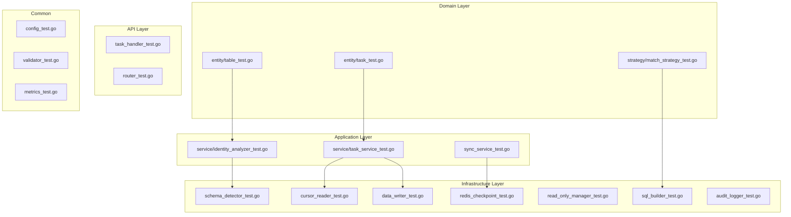

# 单元测试全覆盖计划

## 概述

本文档详细说明了 MySQL-to-Async 项目的单元测试完善计划，目标是实现全面的测试覆盖。

## 当前测试状态

### 已存在的测试文件

| 文件路径 | 状态 | 备注 |
|---------|------|------|
| `internal/config/config_test.go` | ✅ 存在 | 需要增加错误场景测试 |
| `internal/config/validator_test.go` | ✅ 存在 | 需要增加更多验证场景 |
| `internal/task/domain/entity/task_test.go` | ✅ 存在 | 需要增加边界条件测试 |
| `internal/task/application/service/task_storage_test.go` | ✅ 存在 | - |
| `internal/checkpoint/checkpoint_test.go` | ✅ 存在 | 仅测试了内存管理器 |
| `internal/audit/audit_logger_test.go` | ✅ 存在 | 需要增加更多场景 |
| `internal/api/handler/task_handler_test.go` | ✅ 存在 | 需要增加更多API场景 |
| `internal/api/router/router_test.go` | ✅ 存在 | - |
| `internal/metrics/metrics_test.go` | ✅ 存在 | 需要增加指标更新测试 |

### 缺失的测试文件

| 文件路径 | 优先级 | 说明 |
|---------|--------|------|
| `internal/metadata/domain/entity/table_test.go` | P0 | 表实体和列元数据测试 |
| `internal/metadata/domain/service/identity_analyzer_test.go` | P0 | 标识分析器服务测试 |
| `internal/metadata/infrastructure/schema_detector_test.go` | P0 | Schema探测器测试 |
| `internal/sync/domain/strategy/match_strategy_test.go` | P0 | 匹配策略测试 |
| `internal/sync/infrastructure/reader/cursor_reader_test.go` | P0 | 游标读取器测试 |
| `internal/sync/infrastructure/writer/sql_builder_test.go` | P0 | SQL构建器测试 |
| `internal/sync/infrastructure/writer/data_writer_test.go` | P0 | 数据写入器测试 |
| `internal/sync/infrastructure/readonly/read_only_manager_test.go` | P1 | 只读管理器测试 |
| `internal/sync/application/sync_service_test.go` | P1 | 增量同步服务测试 |
| `internal/task/application/service/task_service_test.go` | P0 | 任务服务测试 |

## 详细测试计划

### 1. Metadata 模块测试

#### 1.1 `internal/metadata/domain/entity/table_test.go`

```go
// 测试用例：
- TestTableIdentity_Strategies - 测试所有标识策略类型
- TestColumnMeta_Fields - 测试列元数据字段
- TestTableInfo_JSON - 测试表信息的JSON序列化
- TestIdentityStrategy_Constants - 测试策略常量值
```

#### 1.2 `internal/metadata/domain/service/identity_analyzer_test.go`

```go
// 测试用例：
- TestIdentityAnalyzerService_AnalyzeTable_PK - 主键策略分析
- TestIdentityAnalyzerService_AnalyzeTable_UK - 唯一键策略分析
- TestIdentityAnalyzerService_AnalyzeTable_FullColumns - 全列匹配策略
- TestIdentityAnalyzerService_AnalyzeTable_Error - 错误处理测试
- TestIdentityAnalyzerService_GetAllTables - 获取所有表
- TestIdentityAnalyzerService_GetAllDatabases - 获取所有数据库
// 使用 Mock 实现 TableMetadataRepository
```

#### 1.3 `internal/metadata/infrastructure/schema_detector_test.go`

```go
// 测试用例：
- TestSchemaDetector_GetTableColumns - 获取表列信息
- TestSchemaDetector_GetTableColumns_Empty - 空表处理
- TestSchemaDetector_GetPrimaryKeyColumns - 获取主键列
- TestSchemaDetector_GetPrimaryKeyColumns_NoPK - 无主键表
- TestSchemaDetector_GetUniqueKeyColumns - 获取唯一键列
- TestSchemaDetector_GetAllTables - 获取所有表
- TestSchemaDetector_CheckBinlogRowImage - 检查Binlog配置
// 使用 sqlmock 模拟数据库
```

### 2. Sync 模块测试

#### 2.1 `internal/sync/domain/strategy/match_strategy_test.go`

```go
// 测试用例：
- TestPKMatchStrategy_BuildWhereClause - 主键WHERE子句构建
- TestPKMatchStrategy_GetWhereArgs - 主键参数获取
- TestPKMatchStrategy_GetStrategyName - 策略名称
- TestUKMatchStrategy_BuildWhereClause - 唯一键WHERE子句构建
- TestUKMatchStrategy_GetWhereArgs - 唯一键参数获取
- TestFullColumnMatchStrategy_BuildWhereClause - 全列WHERE子句（含LIMIT 1）
- TestFullColumnMatchStrategy_GetWhereArgs - 全列参数获取
- TestNewMatchStrategy_Factory - 工厂方法测试
```

#### 2.2 `internal/sync/infrastructure/reader/cursor_reader_test.go`

```go
// 测试用例：
- TestCursorReader_ReadBatch - 批量读取测试
- TestCursorReader_ReadBatch_Empty - 空结果测试
- TestCursorReader_GetMaxID - 无主键返回0
- TestCursorReader_GetMinID - 无主键返回0
- TestRangeShardingReader_ReadBatch - 范围分片读取
- TestRangeShardingReader_GetMaxID - 获取最大ID
- TestRangeShardingReader_GetMinID - 获取最小ID
// 使用 sqlmock 模拟数据库
```

#### 2.3 `internal/sync/infrastructure/writer/sql_builder_test.go`

```go
// 测试用例：
- TestSQLBuilder_BuildInsert - INSERT语句构建
- TestSQLBuilder_BuildInsertOnDuplicate - INSERT ON DUPLICATE KEY UPDATE
- TestSQLBuilder_BuildUpdate - UPDATE语句构建
- TestSQLBuilder_BuildDelete - DELETE语句构建
- TestSQLBuilder_BuildBatchInsert - 批量INSERT构建
- TestSQLBuilder_BuildBatchInsert_Empty - 空数据处理
- TestSQLBuilder_GetStrategyName - 获取策略名称
```

#### 2.4 `internal/sync/infrastructure/writer/data_writer_test.go`

```go
// 测试用例：
- TestBatchWriter_WriteBatch - 批量写入测试
- TestBatchWriter_WriteBatch_Empty - 空数据写入
- TestBatchWriter_Update - 更新测试
- TestBatchWriter_Update_NoRowsMatched - 无匹配行处理
- TestBatchWriter_Delete - 删除测试
- TestBatchWriter_Delete_NoRowsMatched - 无匹配行处理
- TestBufferedWriter_Write - 缓冲写入测试
- TestBufferedWriter_Flush - 刷新缓冲区
- TestBufferedWriter_Close - 关闭写入器
// 使用 sqlmock 模拟数据库
```

#### 2.5 `internal/sync/infrastructure/readonly/read_only_manager_test.go`

```go
// 测试用例：
- TestReadOnlyManager_SetReadOnly - 设置只读模式
- TestReadOnlyManager_RestoreReadOnly - 恢复读写模式
- TestReadOnlyManager_RestoreReadOnly_NoState - 无保存状态时恢复
- TestReadOnlyManager_GetReadOnlyState - 获取只读状态
// 使用 sqlmock 模拟数据库
```

#### 2.6 `internal/sync/application/sync_service_test.go`

```go
// 测试用例：
- TestIncrementalSyncService_New - 创建服务
- TestIncrementalSyncService_Start - 启动同步
- TestIncrementalSyncService_Stop - 停止同步
- TestIncrementalSyncService_ProcessAuditLogs - 处理审计日志
// 需要 mock 多个依赖
```

### 3. Task 模块测试

#### 3.1 `internal/task/application/service/task_service_test.go`

```go
// 测试用例：
- TestTaskService_CreateTask - 创建任务
- TestTaskService_GetTask - 获取任务
- TestTaskService_GetTask_NotFound - 任务不存在
- TestTaskService_GetAllTasks - 获取所有任务
- TestTaskService_UpdateTask - 更新任务
- TestTaskService_DeleteTask - 删除任务
- TestTaskService_StartTask - 启动任务
- TestTaskService_PauseTask - 暂停任务
- TestTaskService_SetEnableReadOnly - 设置只读限制
- TestTaskService_GetEnableReadOnly - 获取只读限制状态
- TestTaskService_GetRunningTaskCount - 获取运行中任务数
// 需要 mock 数据库连接
```

### 4. 完善现有测试

#### 4.1 `internal/config/config_test.go` 增强

```go
// 新增测试用例：
- TestLoadConfig_FileNotFound - 文件不存在错误
- TestLoadConfig_InvalidTOML - 无效TOML格式
- TestLoadConfig_EmptyFile - 空配置文件
- TestGlobalConfig_Set - 全局配置设置
- TestHttpConfig_Defaults - HTTP默认配置
- TestLogConfig_Defaults - 日志默认配置
```

#### 4.2 `internal/config/validator_test.go` 增强

```go
// 新增测试用例：
- TestValidator_ValidateAll_Success - 全部验证成功
- TestValidator_ValidateSourceDatabase_Fail - 源库验证失败
- TestValidator_ValidateTargetDatabase_Fail - 目标库验证失败
- TestValidator_ValidateRedis_Fail - Redis验证失败
- TestValidator_ValidateHTTP_InvalidPort - 无效端口
- TestValidator_CheckBinlogConfig - Binlog配置检查
```

#### 4.3 `internal/task/domain/entity/task_test.go` 增强

```go
// 新增测试用例：
- TestSyncTask_Complete - 完成任务
- TestSyncTask_Fail - 任务失败
- TestSyncTask_UpdateProgress - 更新进度
- TestSyncTask_UpdateProgress_ZeroTotal - 总数为0时的进度
- TestTaskConfig_JSON_Serialization - JSON序列化
- TestProcessContext_JSON_Serialization - JSON序列化
- TestDatabaseConfig_JSON - 数据库配置JSON
- TestCheckpoint_Fields - 位点字段测试
```

#### 4.4 `internal/checkpoint/checkpoint_test.go` 增强

```go
// 新增测试用例：
- TestRedisCheckpointManager_Save - Redis保存位点
- TestRedisCheckpointManager_Get - Redis获取位点
- TestRedisCheckpointManager_Get_NotFound - Redis位点不存在
- TestRedisCheckpointManager_GetAll - Redis获取所有位点
- TestRedisCheckpointManager_Delete - Redis删除位点
- TestRedisCheckpointManager_GetPosition - 获取Binlog位置
- TestRedisCheckpointManager_SavePosition - 保存Binlog位置
// 使用 miniredis 模拟 Redis
```

#### 4.5 `internal/audit/audit_logger_test.go` 增强

```go
// 新增测试用例：
- TestAuditLogger_Log_AllEventTypes - 所有事件类型测试
- TestAuditLogger_RotateFile - 文件轮转测试
- TestAuditLogger_Concurrent - 并发写入测试
- TestAuditLogger_LogDataWrite - 数据写入审计
- TestAuditLogger_LogDataUpdate - 数据更新审计
- TestAuditLogger_LogDataDelete - 数据删除审计
- TestAuditLogger_LogSyncStart - 同步开始审计
- TestAuditLogger_LogSyncComplete - 同步完成审计
- TestAuditLogger_LogSyncFailed - 同步失败审计
```

#### 4.6 `internal/api/handler/task_handler_test.go` 增强

```go
// 新增测试用例：
- TestUpdateTask - 更新任务API
- TestDeleteTask - 删除任务API
- TestStartTask - 启动任务API
- TestPauseTask - 暂停任务API
- TestGetTaskMetrics - 获取任务指标API
- TestSkipError - 跳过错误API
- TestGetDefaultConfig - 获取默认配置API
- TestCreateTask_InvalidRequest - 无效请求处理
- TestCreateTask_MissingRequired - 缺少必填字段
```

#### 4.7 `internal/metrics/metrics_test.go` 增强

```go
// 新增测试用例：
- TestMetrics_UpdateTaskMetrics - 更新任务指标
- TestMetrics_RecordSyncDuration - 记录同步时长
- TestMetrics_RecordSyncError - 记录同步错误
- TestMetrics_UpdateBinlogMetrics - 更新Binlog指标
- TestMetrics_Singleton - 单例模式测试
```

## 测试架构图



## Mock 策略

### 数据库 Mock
- 使用 `github.com/DATA-DOG/go-sqlmock` 模拟 SQL 数据库操作
- 模拟查询、执行、事务等操作

### Redis Mock
- 使用 `github.com/alicebob/miniredis` 模拟 Redis 服务器
- 支持所有常用 Redis 命令

### 接口 Mock
- 为 `IdentityAnalyzer`、`TableMetadataRepository` 等接口创建 Mock 实现
- 使用表格驱动测试覆盖多种场景

## 测试覆盖率目标

| 模块 | 目标覆盖率 |
|------|-----------|
| Domain Layer | ≥ 90% |
| Application Layer | ≥ 85% |
| Infrastructure Layer | ≥ 80% |
| API Layer | ≥ 85% |
| Config | ≥ 90% |
| **总体目标** | **≥ 85%** |

## 执行顺序

1. **Phase 1 - Domain Layer Tests** (P0)
   - `table_test.go`
   - `match_strategy_test.go`
   - 完善 `task_test.go`

2. **Phase 2 - Infrastructure Layer Tests** (P0)
   - `sql_builder_test.go`
   - `cursor_reader_test.go`
   - `data_writer_test.go`
   - `schema_detector_test.go`

3. **Phase 3 - Application Layer Tests** (P0)
   - `identity_analyzer_test.go`
   - `task_service_test.go`

4. **Phase 4 - Remaining Tests** (P1)
   - `sync_service_test.go`
   - `read_only_manager_test.go`
   - 完善现有测试文件

5. **Phase 5 - Verification**
   - 运行完整测试套件
   - 生成覆盖率报告
   - 修复未覆盖的边界情况

## 验证命令

```bash
# 运行所有测试
go test ./...

# 运行测试并显示覆盖率
go test -coverprofile=coverage.out ./...

# 查看覆盖率详情
go tool cover -func=coverage.out

# 生成HTML覆盖率报告
go tool cover -html=coverage.out -o coverage.html
```

## 注意事项

1. **测试隔离**: 每个测试应该独立运行，不依赖其他测试的状态
2. **清理资源**: 使用 `t.Cleanup()` 确保测试资源被正确清理
3. **并发安全**: 对于并发组件，添加并发测试用例
4. **错误路径**: 确保测试覆盖错误处理路径
5. **边界条件**: 测试空值、零值、最大值等边界情况
